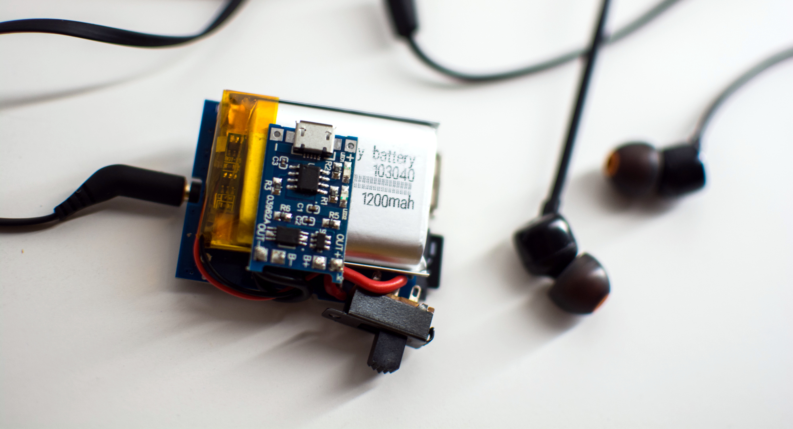

- Project stage: Prototype
- Photos by: [Iza Rzechuła](https://www.iza.rzechula.pl/)

### BoM

| # | Qty | Description |
| --- | :-: | --- |
| 1 | 1 | HW-188 Mp3 Lossless Decoding Board |
| 2 | 1 | TP4056 Linear Lithium Ion Battery Charging Module |
| 3 | 1 | 3.7V 1200mAh 103040 Lipo Battery |
| 4 | 1 | 3 Pin Slide Switch |

### Photos

