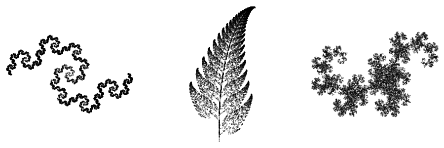
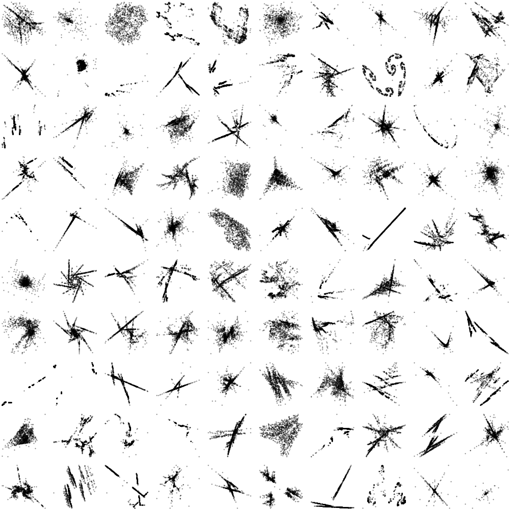

- Tools: Python
- Source code: [https://github.com/vlmarch/py-sketches](https://github.com/vlmarch/py-sketches)
- Links:
    - [Wikipedia - Iterated function system](https://en.wikipedia.org/wiki/Iterated_function_system)
    - [What is an IFS? + Examples](https://cs.lmu.edu/~ray/notes/ifs/)

```python
import itertools
import random

import matplotlib
import matplotlib.pyplot as plt
import numpy as np

matplotlib.use("TkAgg")


RIBBON_IFS = [
    [0.2500, -0.2500, 0.2500, 0.2500, 0.0000, 0.0000, 0.25],
    [0.5000, 0.5000, -0.5000, 0.5000, 0.2500, 0.2500, 0.50],
    [0.2500, -0.2500, 0.2500, 0.2500, 0.7500, -0.2500, 0.25],
]

FERN_IFS = [
    [0.00, 0.00, 0.00, 0.16, 0.0, 0.00, 0.01],
    [0.85, 0.04, -0.04, 0.85, 0.0, 1.60, 0.85],
    [0.20, -0.26, 0.23, 0.22, 0.0, 1.60, 0.07],
    [-0.15, 0.28, 0.26, 0.24, 0.0, 0.44, 0.07],
]

DRAGON_IFS = [
    [0.5, 0.5, -0.5, 0.5, 0, 0, 0.5],
    [-0.5, 0.5, -0.5, -0.5, 1, 0, 0.5],
]


class IFSToPoints:
    def __init__(self, ifs=None):
        if ifs is None:
            self._ifs = IFSToPoints.generate_random_ifc()
        else:
            self._ifs = ifs
        self._list_of_points = [(0, 0)]
        self._functions = [IFSToPoints._generate_f(*i[:-1]) for i in self._ifs]
        self._ps = list(itertools.accumulate((i[-1] for i in self._ifs)))

    @staticmethod
    def _generate_f(a, b, c, d, e, f):
        def _f(x, y):
            _x = a * x + b * y + e
            _y = c * x + d * y + f
            return _x, _y

        return _f

    @staticmethod
    def generate_random_ifc(lines=None):
        if lines is None:
            lines = random.randint(2, 4)
        ps = [random.random() for _ in range(lines)]
        ps_temp = list(itertools.accumulate(ps))
        ps = list(map(lambda a: a / max(ps_temp), ps))
        random_ifc = [
            [random.random() * 2 - 1 for _ in range(6)] + [ps[i]]
            for i in range(lines)
        ]
        return random_ifc

    def generate(self, number_of_points: int = 1000):
        for j in range(number_of_points):
            val = random.random()
            for p, f in zip(self._ps, self._functions):
                if val < p:
                    self._list_of_points.append(f(*self._list_of_points[-1]))
                    break
        return self._list_of_points


if __name__ == "__main__":
    ifs_to_pts = IFSToPoints(DRAGON_IFS)
    pts = ifs_to_pts.generate(number_of_points=10000)
    pts = np.array(pts).T
    plt.scatter(*pts, c="k", s=0.3, alpha=0.5)

    plt.show()
```

"Classic" fractals:


Randomly generated fractals:

