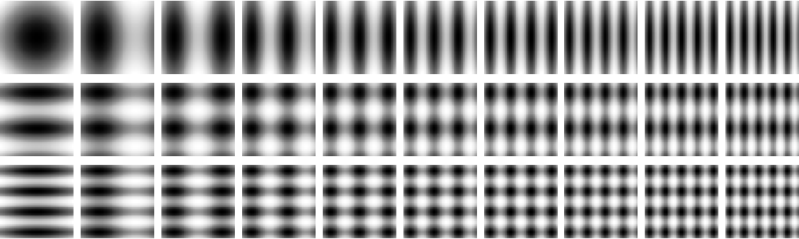

- Tools: Python
- Source code: [https://github.com/vec2pt/py-sketches](https://github.com/vec2pt/py-sketches)

```python
import matplotlib
import matplotlib.pyplot as plt
import numpy as np

matplotlib.use("TkAgg")


def gradient(
    width: int = 50,
    height: int = 50,
    factor1_min: float = 1,
    factor1_max: float = 1,
    factor2_min: float = 1,
    factor2_max: float = 1,
):
    grid = np.indices((height, width))
    grid_min, grid_max = grid.min(), grid.max()

    row = np.interp(grid[0], (grid_min, grid_max), (0, np.pi))
    col = np.interp(grid[1], (grid_min, grid_max), (0, np.pi))

    factor_template = np.arange(0, width, 1)
    factor1 = np.interp(factor_template, (0, width), (factor1_min, factor1_max))
    factor1 = np.repeat(factor1, height).reshape(height, width)

    factor2 = np.interp(factor_template, (0, width), (factor2_min, factor2_max))
    factor2 = np.repeat(factor2, height).reshape(height, width)

    return np.sin(row * factor1) + np.sin(col * factor2)


if __name__ == "__main__":
    gradient_array = gradient(
        factor2_min=5,
        factor2_max=5,
    )
    plt.imshow(gradient_array, cmap="Greys", interpolation="nearest")
    plt.show()
```





