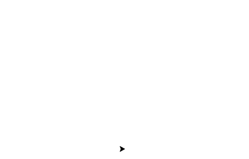

- Tools: Python
- Source code: [https://github.com/vec2pt/py-sketches](https://github.com/vec2pt/py-sketches)

```python
import turtle


def recursion_tree_v1(
    length=100, l_angle=20, r_angle=50, n=6, p_l=0.8, p_a=0.7
):
    """Recursion Tree v1.

    Args:
        length (float, optional): the length of first branch. Defaults to 100.
        l_angle (float, optional): left branch angle. Defaults to 20.
        r_angle (float, optional): right branch angle. Defaults to 50.
        n (int, optional): number of loops. Defaults to 6.
        p_l (float, optional): length changer (percentage). Defaults to 0.8.
        p_a (float, optional): angle changer (percentage). Defaults to 0.7.
    """

    if n == 0:
        return
    turtle.forward(length)
    turtle.left(l_angle)
    recursion_tree_v1(
        length * p_l, l_angle * p_a, r_angle * p_a, n=n - 1, p_l=p_l, p_a=p_a
    )
    turtle.right(r_angle + l_angle)
    recursion_tree_v1(
        length * p_l, l_angle * p_a, r_angle * p_a, n=n - 1, p_l=p_l, p_a=p_a
    )

    turtle.penup()
    turtle.left(r_angle)
    turtle.backward(length)
    turtle.pendown()


def recursion_tree_v2(length=100, angle=100, n=6, b=4, p_l=0.7, p_a=0.7):
    """Recursion Tree v2.

    Args:
        length (float, optional): the length of first branch. Defaults to 100.
        angle (float, optional): tree crown angle. Defaults to 100.
        n (int, optional): number of loops. Defaults to 6.
        b (int, optional): number of branches. Defaults to 4.
        p_l (float, optional): length changer (percentage). Defaults to 0.7.
        p_a (float, optional): angle changer (percentage). Defaults to 0.7.
    """

    if n == 0:
        return
    turtle.forward(length)
    for k in range(b):
        if k == 0:
            turtle.right(angle / 2)
        else:
            turtle.left(angle / (b - 1))
        recursion_tree_v2(
            length * p_l, angle * p_a, n=n - 1, b=b, p_l=p_l, p_a=p_l
        )

    turtle.penup()
    turtle.right(angle / 2)
    turtle.backward(length)
    turtle.pendown()


if __name__ == "__main__":
    # Properties
    turtle.Screen().setup(750, 750)
    # turtle.hideturtle()
    turtle.speed(0)

    turtle.left(90)
    recursion_tree_v1(length=60, l_angle=50, r_angle=20, n=6, p_l=0.9, p_a=0.65)
    # recursion_tree_v2(length=60, angle=100, n=5, b=4, p_l=0.8, p_a=0.8)

    turtle.done()
```

Version 1:



Version 2:


