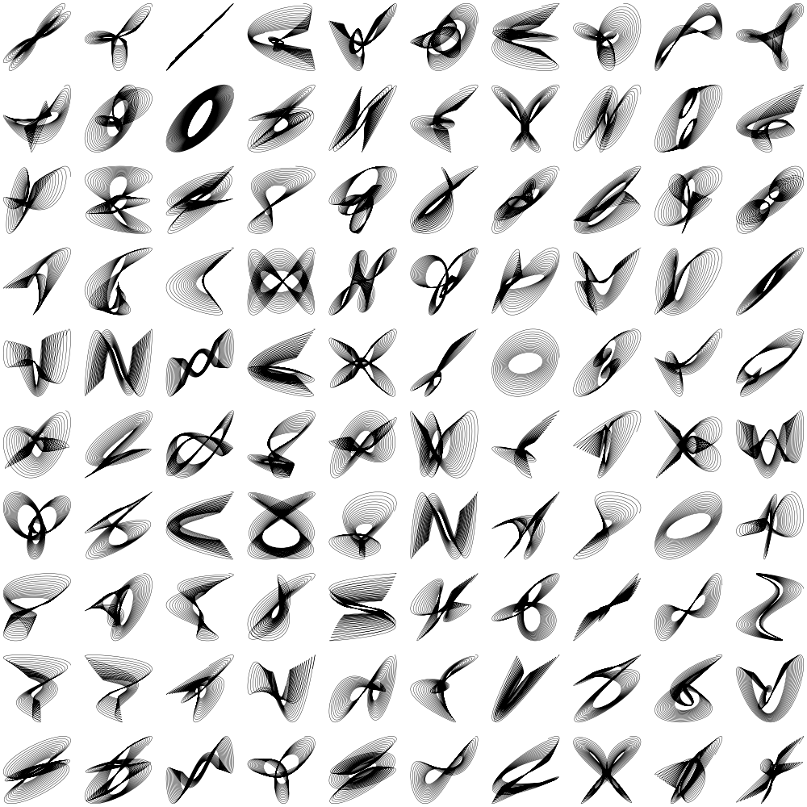

- Tools: Python
- Source code: [https://github.com/vec2pt/py-sketches](https://github.com/vec2pt/py-sketches)
- Links:
    - [Wikipedia - Harmonograph](https://en.wikipedia.org/wiki/Harmonograph)


```python
import matplotlib
import matplotlib.pyplot as plt
import numpy as np

matplotlib.use("TkAgg")


class Harmonograph2D:
    """Harmonograph 2D"""

    def __init__(
        self,
        amplitude,
        phase,
        decay,
        frequency,
    ) -> None:
        """Init Harmonograph 2D

        Args:
            amplitude (list): Amplitude.
            phase (list): Phase.
            decay (list): Decay.
            frequency (list): Frequency.
        """
        self._amplitude = amplitude
        self._phase = phase
        self._decay = decay
        self._frequency = frequency

    @staticmethod
    def create_random_inputs():
        a = np.ones(4, dtype=np.float64)
        p = np.random.random(4) * 2
        d = np.random.random(4) / 50
        f = np.random.randint(1, 4, 4)
        return a, p, d, f

    @staticmethod
    def _gen_f(amplitude, phase, decay, frequency):
        def _f(time, i):
            return (
                amplitude[i]
                * np.sin(time * frequency[i] + phase[i])
                * np.e ** (-decay[i] * time)
            )

        return _f

    def generate(
        self,
        star_time=0,
        end_time=100,
        time_delta=0.01,
    ):
        """Generate Harmonograph 2D

        Args:
            star_time (float, optional): Star time. Defaults to 0.
            end_time (float, optional): End time. Defaults to 100.
            time_delta (float, optional): Time delta. Defaults to 0.01.

        Returns:
            tuple: x, y
        """
        t = np.arange(star_time, end_time, time_delta)
        f = Harmonograph2D._gen_f(
            self._amplitude, self._phase, self._decay, self._frequency
        )
        return f(t, 0) + f(t, 1), f(t, 2) + f(t, 3)


if __name__ == "__main__":
    a = [1, 1, 1, 1]  # Amplitude
    p = [1.57, 1, 0, 1.23]  # Phase
    d = [0.002, 0.001, 0.002, 0.001]  # Decay
    f = [1, 2, 2, 1]  # Frequency

    harmonograph = Harmonograph2D(a, p, d, f)

    plt.plot(*harmonograph.generate(), color="k", linewidth=0.3)
    plt.show()
```

Randomly generated:

