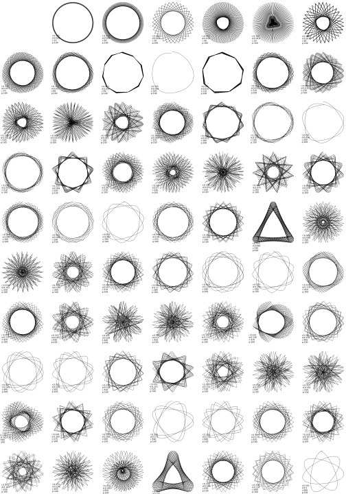
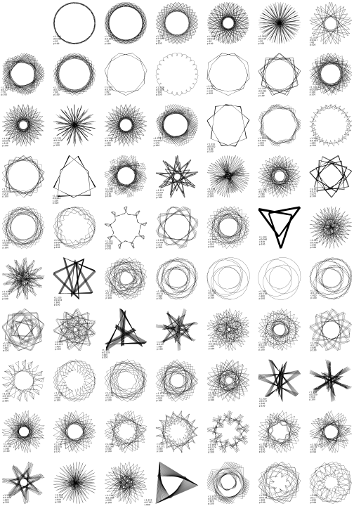
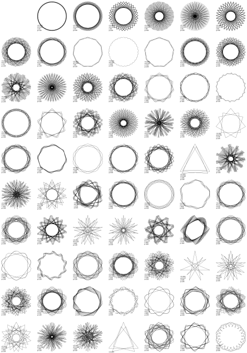
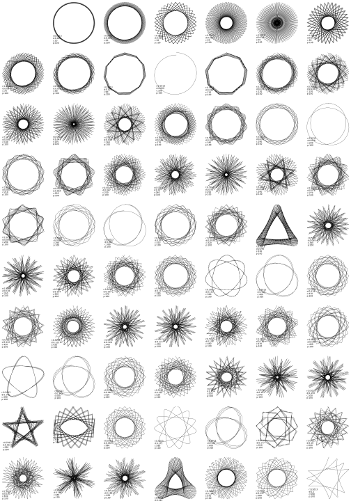

Links:
- [Wikipedia - Spirograph](https://en.wikipedia.org/wiki/Spirograph)
- [Wikipedia - Hypocycloid](https://en.wikipedia.org/wiki/Hypocycloid)
- [Wikipedia - Deltoid curve](https://en.wikipedia.org/wiki/Deltoid_curve)
- [Wikipedia - Hypotrochoid](https://en.wikipedia.org/wiki/Hypotrochoid)

```python
import matplotlib
import matplotlib.pyplot as plt
import numpy as np

matplotlib.use("TkAgg")


def spirograph(
    radius1=1.0,
    radius2=0.6,
    distance=1.2,
    cycles=3,
    number_of_control_points=300,
    scale=True,
):
    """Spirograph

    Args:
        radius1 (float, optional): `Exterior` circle radius. Defaults to 1.0.
        radius2 (float, optional): `Interior` circle radius. Defaults to 0.6.
        distance (float, optional): Distance from the center of the `interior`
            circle. Defaults to 1.2.
        cycles (float, optional): Full cycles. Defaults to 3.
        number_of_control_points (int, optional): Number of control points.
            Defaults to 300.
        scale (bool, optional): Scale points. Defaults to True.

    Returns:
        tuple: Points x, y.
    """

    fi = np.linspace(0, cycles * 2 * np.pi, number_of_control_points)
    r_difference = radius1 - radius2

    x = r_difference * np.sin(fi) - distance * np.sin(
        fi * r_difference / radius2
    )
    y = r_difference * np.cos(fi) + distance * np.cos(
        fi * r_difference / radius2
    )
    if scale:
        max_val = max([np.max(x), np.max(y)])
        x *= 1 / max_val
        y *= 1 / max_val

    return x, y


if __name__ == "__main__":
    x, y = spirograph(
        radius1=1.0,
        radius2=0.062,
        distance=0.9,
        cycles=3,
        number_of_control_points=100,
    )

    plt.plot(x, y, c="k", linewidth=0.2)
    plt.show()
```
<!--  -->

<!--  -->




