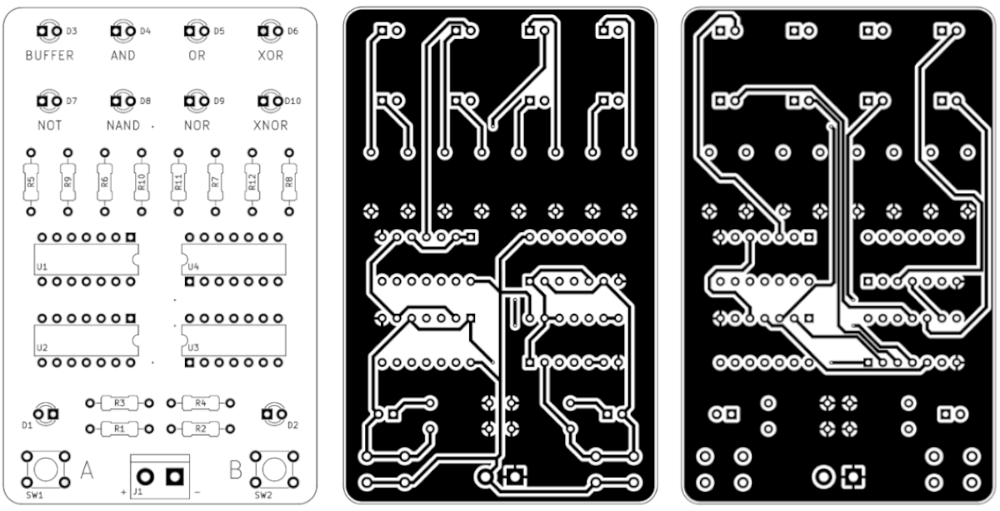
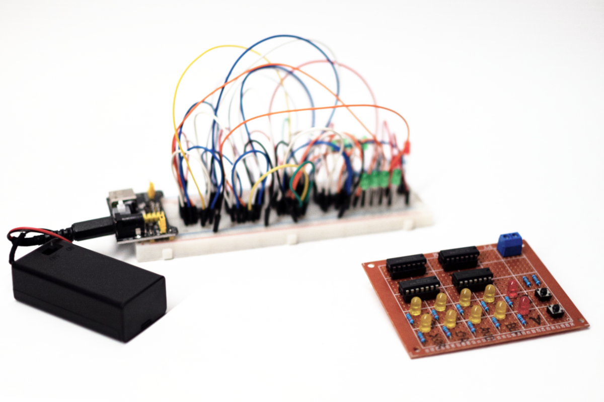

- Project stage: Prototype
- Tools: KiCad
- Photos by: [Iza Rzechuła](https://www.iza.rzechula.pl/)
- Inspirations:
    - [Educational logic gates PCB](https://www.pcbway.com/project/shareproject/Educational_logic_gates_PCB.html)

Simple logic gates circuit.

### Bill of Materials (BOM)

|#  |Reference                                |Qty|Value            |Footprint                                        |
|---|-----------------------------------------|:-:|-----------------|-------------------------------------------------|
|1  |D1, D2, D3, D4, D5, D6, D7, D8, D9, D10  |10 |LED              |LED_THT:LED_D3.0mm                               |
|2  |J1                                       |1  |Conn_01x02_Socket|TerminalBlock_bornier-2_P5.08mm                  |
|3  |R1, R2                                   |2  |10K              |R_Axial_DIN0207_L6.3mm_D2.5mm_P10.16mm|
|4  |R3, R4, R5, R6, R7, R8, R9, R10, R11, R12|10 |220              |R_Axial_DIN0207_L6.3mm_D2.5mm_P10.16mm|
|5  |SW1, SW2                                 |2  |SW_Push_Dual     |SW_PUSH_6mm_H4.3mm                               |
|6  |U1                                       |1  |4081             |DIP-14_W7.62mm                                   |
|7  |U2                                       |1  |4071             |DIP-14_W7.62mm                                   |
|8  |U3                                       |1  |4011             |DIP-14_W7.62mm                                   |
|9  |U4                                       |1  |4030             |DIP-14_W7.62mm                                   |

### PCB Design

\* The PCB has not been manufactured.

### Photos

