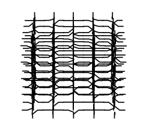

- Tools: Python
- Source code: [https://github.com/vec2pt/py-sketches](https://github.com/vec2pt/py-sketches)



```python
import itertools
import random

import matplotlib
import matplotlib.pyplot as plt
import numpy as np


def _get_voxel_faces(i, j, z, offset=0.5):
    return [
        (i + offset, j, z),
        (i - offset, j, z),
        (i, j + offset, z),
        (i, j - offset, z),
        (i, j, z + offset),
        (i, j, z - offset),
    ]


def create_grid(grid_size: int = 5) -> list:
    grid = itertools.product(range(grid_size), repeat=3)
    segments = []
    for voxel in grid:
        faces = _get_voxel_faces(*voxel)
        for _ in range(3):
            v1, v2 = random.sample(faces, 2)
            faces.remove(v1)
            faces.remove(v2)
            v1 = np.array(v1)
            v4 = np.array(v2)
            segments.append(
                [
                    v1,
                    v1 + (np.array(voxel) - v1) / 2,
                    v4 + (np.array(voxel) - v4) / 2,
                    v4,
                ]
            )
    return segments


if __name__ == "__main__":
    matplotlib.use("TkAgg")
    fig = plt.figure()
    ax = fig.add_subplot(111, projection="3d")
    ax.set_axis_off()

    segments = create_grid(5)

    for segment in segments:
        ax.plot(*np.array(segment).T, c="black")
    plt.show()
```
