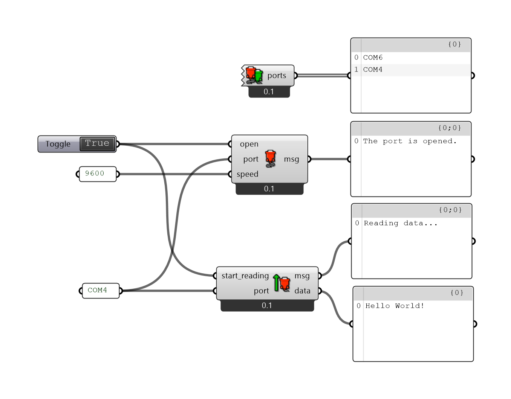

- Tools: grasschopper, Python

A package of serial communication nodes for a grasshopper. Useful, for example, for controlling an Arduino or getting data from sensors.

### Features
- Show available serial ports.
- Open/Clouse serial port.
- Reading from a serial port.
- Writing to a serial port.

