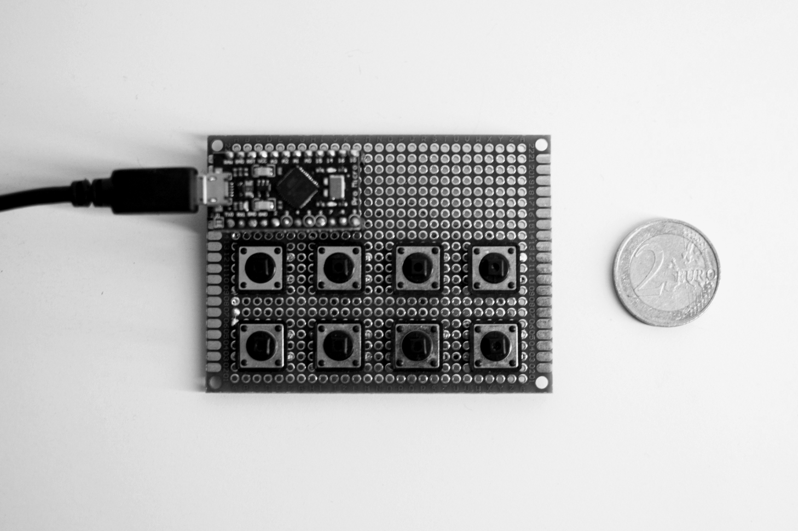
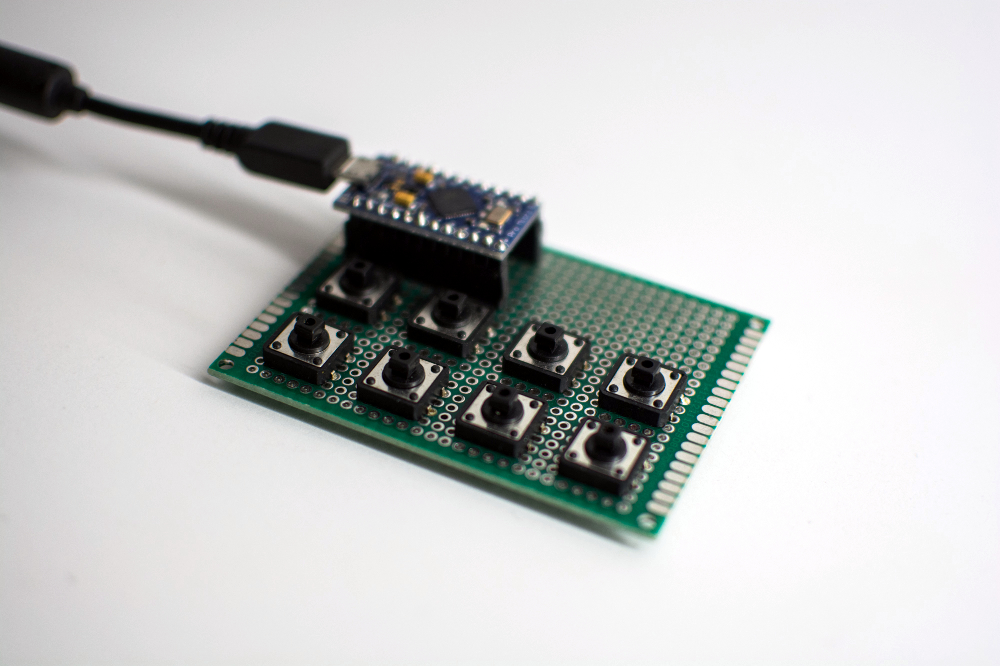

- Project stage: Prototype
- Tools: Arduino IDE
- Photos by: [Iza Rzechuła](https://www.iza.rzechula.pl/)


### BoM

| # | Qty | Description |
| --- | :-: | --- |
| 1 | 1 | Arduino Pro Micro ATmega32U4 5V 16MHz |
| 2 | 8 | Tact Switch 12x12 |
| 3 | 1 | ACS PCB6X8 |

### Photos





### Code

```c
#include <Keyboard.h>
#include <Bounce2.h>

#define KEY_F13 0xF0
#define KEY_F14 0xF1
#define KEY_F15 0xF2
#define KEY_F16 0xF3
#define KEY_F17 0xF4
#define KEY_F18 0xF5
#define KEY_F19 0xF6
#define KEY_F20 0xF7

#define BUTTON_F13_PIN 2
#define BUTTON_F14_PIN 3
#define BUTTON_F15_PIN 4
#define BUTTON_F16_PIN 5
#define BUTTON_F17_PIN 6
#define BUTTON_F18_PIN 7
#define BUTTON_F19_PIN 8
#define BUTTON_F20_PIN 9

Bounce2::Button buttonF13 = Bounce2::Button();
Bounce2::Button buttonF14 = Bounce2::Button();
Bounce2::Button buttonF15 = Bounce2::Button();
Bounce2::Button buttonF16 = Bounce2::Button();
Bounce2::Button buttonF17 = Bounce2::Button();
Bounce2::Button buttonF18 = Bounce2::Button();
Bounce2::Button buttonF19 = Bounce2::Button();
Bounce2::Button buttonF20 = Bounce2::Button();

const int debounce_interval = 25; // 5

void setup() {
    buttonF13.attach(BUTTON_F13_PIN, INPUT_PULLUP);
    buttonF13.interval(debounce_interval);
    buttonF13.setPressedState(LOW);

    buttonF14.attach(BUTTON_F14_PIN, INPUT_PULLUP);
    buttonF14.interval(debounce_interval);
    buttonF14.setPressedState(LOW);

    buttonF15.attach(BUTTON_F15_PIN, INPUT_PULLUP);
    buttonF15.interval(debounce_interval);
    buttonF15.setPressedState(LOW);

    buttonF16.attach(BUTTON_F16_PIN, INPUT_PULLUP);
    buttonF16.interval(debounce_interval);
    buttonF16.setPressedState(LOW);

    buttonF17.attach(BUTTON_F17_PIN, INPUT_PULLUP);
    buttonF17.interval(debounce_interval);
    buttonF17.setPressedState(LOW);

    buttonF18.attach(BUTTON_F18_PIN, INPUT_PULLUP);
    buttonF18.interval(debounce_interval);
    buttonF18.setPressedState(LOW);

    buttonF19.attach(BUTTON_F19_PIN, INPUT_PULLUP);
    buttonF19.interval(debounce_interval);
    buttonF19.setPressedState(LOW);

    buttonF20.attach(BUTTON_F20_PIN, INPUT_PULLUP);
    buttonF20.interval(debounce_interval);
    buttonF20.setPressedState(LOW);

    Keyboard.begin();
}

void loop() {
    buttonF13.update();
    buttonF14.update();
    buttonF15.update();
    buttonF16.update();
    buttonF17.update();
    buttonF18.update();
    buttonF19.update();
    buttonF20.update();

    if (buttonF13.pressed()){Keyboard.press(KEY_F13); Keyboard.release(KEY_F13);}
    if (buttonF14.pressed()){Keyboard.press(KEY_F14); Keyboard.release(KEY_F14);}
    if (buttonF15.pressed()){Keyboard.press(KEY_F15); Keyboard.release(KEY_F15);}
    if (buttonF16.pressed()){Keyboard.press(KEY_F16); Keyboard.release(KEY_F16);}
    if (buttonF17.pressed()){Keyboard.press(KEY_F17); Keyboard.release(KEY_F17);}
    if (buttonF18.pressed()){Keyboard.press(KEY_F18); Keyboard.release(KEY_F18);}
    if (buttonF19.pressed()){Keyboard.press(KEY_F19); Keyboard.release(KEY_F19);}
    if (buttonF20.pressed()){Keyboard.press(KEY_F20); Keyboard.release(KEY_F20);}
}
```
