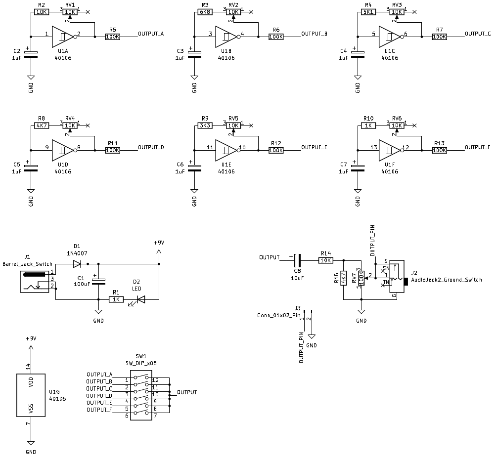
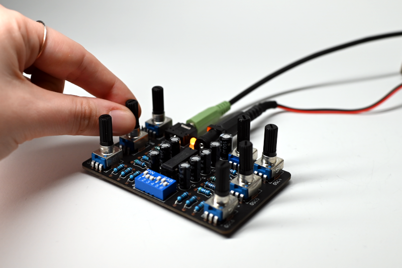
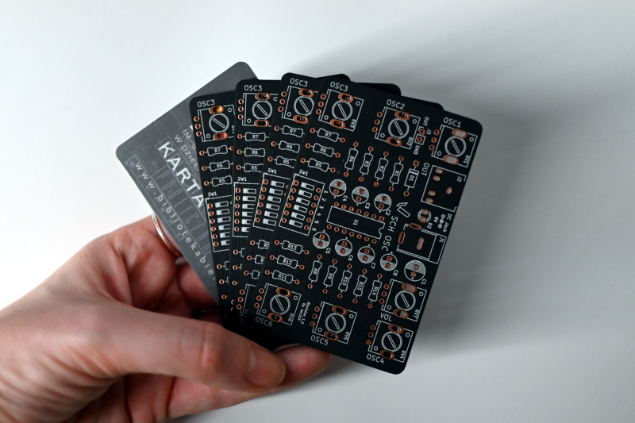

- Project stage: Prototype
- Tools: KiCad
- Vimeo: [Vimeo](https://vimeo.com/{{ site.vimeo_username }})
- Photos by: [Iza Rzechuła](https://www.iza.rzechula.pl/)
- Inspirations:
    - [Hex Oscillator using 40106](https://andreassiagian.wordpress.com/2013/03/10/hex-oscillator-using-40106-tutorial/)

This project is based on Hex Oscillator, which was originally created by Andreas Siagian.

### Schematic

### Photos

### Bill of Materials (BOM)

|#  |Reference                   |Qty|Value                   |Footprint                                                              |
|---|----------------------------|:-:|------------------------|-----------------------------------------------------------------------|
|1  |C1                          |1  |100uF                   |CP_Radial_D6.3mm_P2.50mm                         |
|2  |C2, C3, C4, C5, C6, C7      |6  |1uF                     |CP_Radial_D5.0mm_P2.50mm                         |
|3  |C8                          |1  |10uF                    |CP_Radial_D5.0mm_P2.50mm                         |
|4  |D1                          |1  |1N4007                  |D_A-405_P10.16mm                                  |
|5  |D2                          |1  |LED                     |LED_D3.0mm                                                     |
|6  |J1                          |1  |Barrel_Jack_Switch      |BarrelJack_54-00166                              |
|7  |J2                          |1  |AudioJack2_Ground_Switch|AudioJack_3.5                                    |
|8  |J3                          |1  |Conn_01x02_Pin          |PinHeader_1x02_P2.54mm             |
|9  |R1, R10                     |2  |1K                      |R_Axial_DIN0207_L6.3mm_D2.5mm_P10.16mm|
|10 |R2, R14                     |2  |10K                     |R_Axial_DIN0207_L6.3mm_D2.5mm_P10.16mm|
|11 |R3                          |1  |6K8                     |R_Axial_DIN0207_L6.3mm_D2.5mm_P10.16mm|
|12 |R4                          |1  |5K1                     |R_Axial_DIN0207_L6.3mm_D2.5mm_P10.16mm|
|13 |R5, R6, R7, R11, R12, R13   |6  |100K                    |R_Axial_DIN0207_L6.3mm_D2.5mm_P10.16mm|
|14 |R8, R15                     |2  |4K7                     |R_Axial_DIN0207_L6.3mm_D2.5mm_P10.16mm|
|15 |R9                          |1  |3K3                     |R_Axial_DIN0207_L6.3mm_D2.5mm_P10.16mm|
|16 |RV1, RV2, RV3, RV4, RV5, RV6|6  |10K                     |Potentiometer_R9011                              |
|17 |RV7                         |1  |100K                    |Potentiometer_R9011                              |
|18 |SW1                         |1  |SW_DIP_x06              |SW_DIP_SPSTx06_Slide_9.78x17.42mm    |
|19 |U1                          |1  |40106                   |DIP-14_W7.62mm                                             |

### Files
- [20220106-sch-osc-schematic.pdf](../assets/files/20220106-sch-osc-schematic.pdf)
- [20231228-sch-osc-gerber.zip](../assets/files/20231228-sch-osc-gerber.zip)
