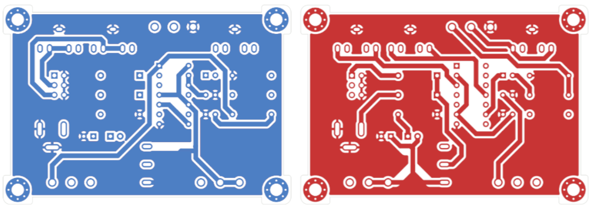

- Project stage: Demo Edition
- Tools: KiCad
- Source code: [https://github.com/vlmarch/py-sketches](https://github.com/vlmarch/py-sketches)
- Vimeo: [Vimeo](https://vimeo.com/vlmarch)
- Photos by: [Iza Rzechuła](https://www.iza.rzechula.pl/)
- Links:
    - [Wikipedia - Stepped-tone generator](https://en.wikipedia.org/wiki/Forrest_Mims#Stepped-tone_generator_(Atari_Punk_Console))
    - [Atari Punk Console](https://sdiy.info/wiki/Atari_Punk_Console)

This project is based on Atari Punk Console (Stepped Tone Generator),
which was originally created by Forrest Mims.

### Schematic

### Photos

<!--  -->

### BoM

| # |Reference |Qty|Value                   |Footprint                                                              |
|---|----------|:-:|------------------------|-----------------------------------------------------------------------|
|1  |C1        |1  |100u                    |CP_Radial_D6.3mm_P2.50mm                         |
|2  |C2        |1  |10n                     |C_Disc_D3.4mm_W2.1mm_P2.50mm                             |
|3  |C3        |1  |100n                    |C_Disc_D3.4mm_W2.1mm_P2.50mm                             |
|4  |C4        |1  |10u                     |CP_Radial_D5.0mm_P2.50mm                         |
|5  |D1, D2    |2  |1N4007                  |D_A-405_P10.16mm_Horizontal                                  |
|6  |D3        |1  |LED                     |LED_D3.0mm                                                     |
|7  |J1        |1  |Barrel_Jack_Switch      |BarrelJack_54-00166                              |
|8  |J2        |1  |Conn_01x06_Male         |PinHeader_2x03_P2.54mm_Vertical             |
|9  |J3, J4, J5|3  |AudioJack2_Ground_Switch|AudioJack_3.5                                    |
|10 |R1, R2    |2  |1K                      |R_Axial_L6.3mm_D2.5mm_P10.16mm|
|11 |R3        |1  |10K                     |R_Axial_L6.3mm_D2.5mm_P10.16mm|
|12 |R4        |1  |4K7                     |R_Axial_L6.3mm_D2.5mm_P10.16mm|
|13 |RV1, RV2  |2  |500K                    |P160                                             |
|14 |RV3       |1  |100K                    |P160                                             |
|15 |SW1       |1  |SW_SPDT                 |MTS103                                           |
|16 |U1        |1  |NE556                   |Package_DIP:DIP-14_W7.62mm                                             |

### PCB

### Files
- [20220418-apc.pdf](../assets/files/20220418-apc.pdf)
