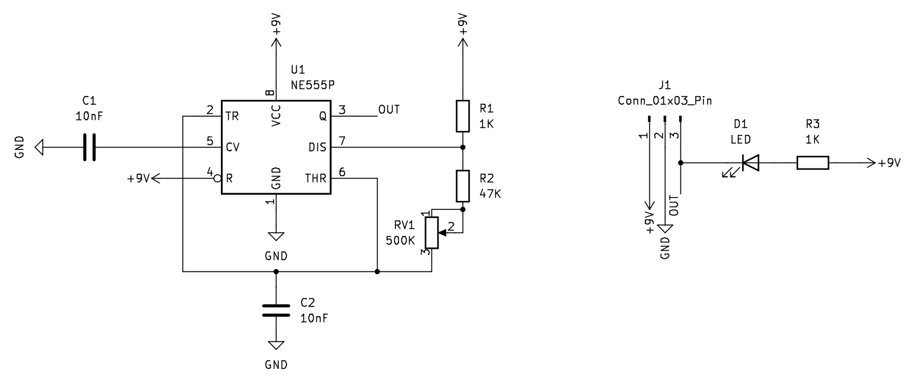
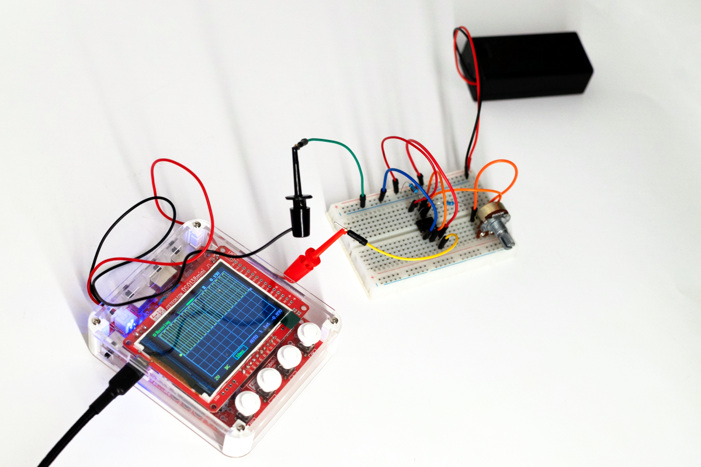
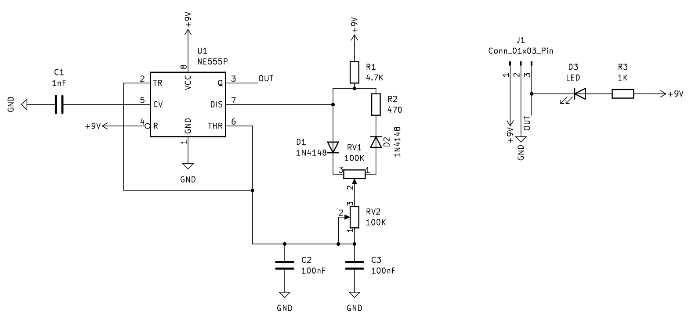
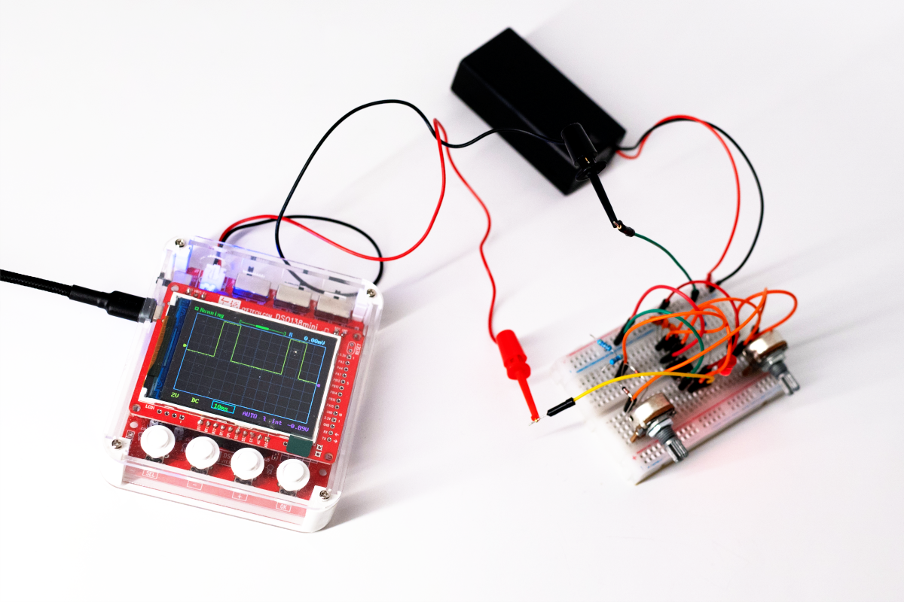

- Project stage: Prototype
- Tools: KiCad
- Photos by: [Iza Rzechuła](https://www.iza.rzechula.pl/)

Two typical pulse generators that I use in my projects.

### Type A

#### Schematic

#### BoM

|#  |Reference|Qty|Value         |
|---|---------|:-:|--------------|
|1  |C1, C2   |2  |10nF          |
|2  |D1       |1  |LED           |
|3  |J1       |1  |Conn_01x03_Pin|
|4  |R1       |1  |1K            |
|5  |R2       |1  |47K           |
|6  |R3       |1  |1K            |
|7  |RV1      |1  |500K          |
|8  |U1       |1  |NE555P        |

#### Photos

### Type B

#### Schematic

#### BoM

|#  |Reference|Qty|Value         |
|---|---------|:-:|--------------|
|1  |C1       |1  |1nF           |
|2  |C2, C3   |2  |100nF         |
|3  |D1, D2   |2  |1N4148        |
|4  |D3       |1  |LED           |
|5  |J1       |1  |Conn_01x03_Pin|
|6  |R1       |1  |4.7K          |
|7  |R2       |1  |470           |
|8  |R3       |1  |1K            |
|9  |RV1, RV2 |2  |100K          |
|10 |U1       |1  |NE555P        |

#### Photos

