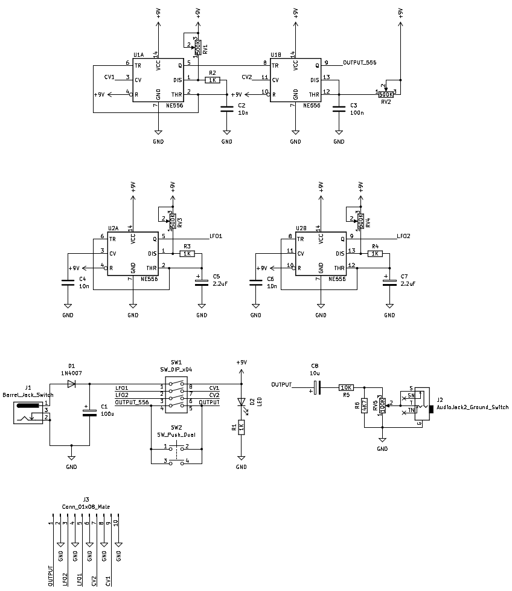
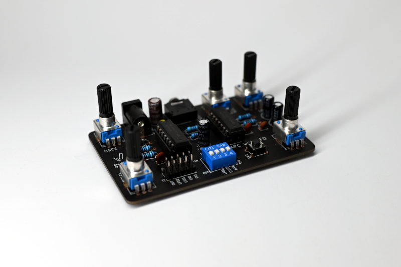

- Project stage: Prototype
- Tools: KiCad
- Vimeo: [Vimeo](https://vimeo.com/{{ site.vimeo_username }})
- Photos by: [Iza Rzechuła](https://www.iza.rzechula.pl/)
- Links:
    - [Wikipedia - Stepped-tone generator](https://en.wikipedia.org/wiki/Forrest_Mims#Stepped-tone_generator_(Atari_Punk_Console))
    - [Atari Punk Console](https://sdiy.info/wiki/Atari_Punk_Console)

This project is based on Atari Punk Console (Stepped Tone Generator),
which was originally created by Forrest Mims.

\* **NOTE**: This project was created for personal use only and is not commercial.

### Schematic

### Photos

### Bill of Materials (BOM)

|#  |Reference         |Qty|Value                   |Footprint                                                              |
|---|------------------|:-:|------------------------|-----------------------------------------------------------------------|
|1  |C1                |1  |100u                    |CP_Radial_D6.3mm_P2.50mm                         |
|2  |C2, C4, C6        |3  |10n                     |C_Disc_D3.4mm_W2.1mm_P2.50mm                             |
|3  |C3                |1  |100n                    |C_Disc_D3.4mm_W2.1mm_P2.50mm                             |
|4  |C5, C7            |2  |2.2uF                   |CP_Radial_D6.3mm_P2.50mm                         |
|5  |C8                |1  |10u                     |CP_Radial_D5.0mm_P2.50mm                         |
|6  |D1                |1  |1N4007                  |D_A-405_P10.16mm                                  |
|7  |D2                |1  |LED                     |LED_D3.0mm                                                     |
|8  |J1                |1  |Barrel_Jack_Switch      |BarrelJack_54-00166                              |
|9  |J2                |1  |AudioJack2_Ground_Switch|AudioJack_3.5                                    |
|10 |J3                |1  |Conn_01x08_Male         |PinHeader_2x05_P2.54mm             |
|11 |R1, R2, R3, R4    |4  |1K                      |R_Axial_DIN0207_L6.3mm_D2.5mm_P10.16mm|
|12 |R5                |1  |10K                     |R_Axial_DIN0207_L6.3mm_D2.5mm_P10.16mm|
|13 |R6                |1  |4K7                     |R_Axial_DIN0207_L6.3mm_D2.5mm_P10.16mm|
|14 |RV1, RV2, RV3, RV4|4  |500K                    |Potentiometer_R9011                              |
|15 |RV5               |1  |100K                    |Potentiometer_R9011                              |
|16 |SW1               |1  |SW_DIP_x04              |SW_DIP_SPSTx04_Slide_9.78x12.34mm_W7.62mm_P2.54mm    |
|17 |SW2               |1  |SW_Push_Dual            |SW_PUSH_6mm_H4.3mm                               |
|18 |U1, U2            |2  |NE556                   |DIP-14_W7.62mm                                             |

### Files
- [20220620-apc-lfo-schematic.pdf](../assets/files/20220620-apc-lfo-schematic.pdf)
- [20231228-apc-lfo-gerber.zip](../assets/files/20231228-apc-lfo-gerber.zip)
