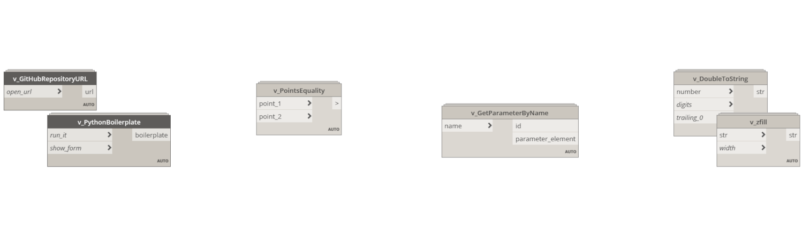

- Tools: Dynamo, Python + Revit API
- Source code: [https://github.com/vlmarch/dynamo-v-nodes](https://github.com/vlmarch/dynamo-v-nodes)

Several simple custom nodes for [Dynamo](https://dynamobim.org).

## Installation

1. Download ZIP file of a Git repository.
2. Extract ZIP file content.
3. In Dynamo go to "Settings" Tab and select "Manage Node and Package Paths..."
4. Add a new path using "+" icon then select "nodes" folder in extracted directory. Path example: `C:\Users\<UserName>\Downloads\dynamo-v-nodes-main\nodes`

## Usage

- Elements and types selectors
- Data filters
- Data convertors
- Model elements operations
- Mathematics functions
- Geometry operations
- Simple UI nodes
- Linked elements selectors
- etc.

## License

Distributed under the MIT License.
