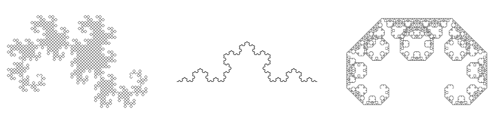

- Tools: Python
- Source code: [https://github.com/vec2pt/py-sketches](https://github.com/vec2pt/py-sketches)
- Links:
    - [Wikipedia - Fractal curve](https://en.wikipedia.org/wiki/Fractal_curve)

```python
import matplotlib
import matplotlib.pyplot as plt
import numpy as np

matplotlib.use("TkAgg")

DRAGON_SEGMENT_SHAPE = np.array([[0, 0.5, 1], [0, 0.5, 0]])
KOCH_SEGMENT_SHAPE = np.array(
    [[0, 1 / 3, 0.5, 2 / 3, 1], [0, 0, 3**0.5 / 6, 0, 0]]
)


def transform(shape, translate=None, scale=None, angle=0):
    """Transform

    Args:
        shape (np.array): Shape.
        translate (tuple, optional): (x, y) Translate. Defaults to None.
        scale (tuple, optional): (x, y) Scale. Defaults to None.
        angle (float, optional): Angle in radians. Defaults to 0.

    Returns:
        np.array: Shape after transformation.
    """
    shape = np.append(shape, np.ones((1, len(shape[0]))), axis=0)

    if translate is None:
        translate = (0, 0)
    if scale is None:
        scale = (1, 1)

    translate_x, translate_y = translate
    scale_x, scale_y = scale

    transform_matrix = np.array(
        [
            [
                np.cos(angle) * scale_x,
                -np.sin(angle) * scale_y,
                translate_x,
            ],
            [
                np.sin(angle) * scale_x,
                np.cos(angle) * scale_y,
                translate_y,
            ],
            [0, 0, 1],
        ]
    )
    new_shape = np.matmul(transform_matrix, shape)
    return new_shape[:-1, :]


class FractalCurve:
    "Fractal curve"

    def __init__(
        self,
        segment_shape,
        loops=5,
        yflip_mask=None,
    ) -> None:
        """Fractal curve

        Args:
            segment_shape (np.array): Start segment shape.
            loops (int, optional): Number of loops. Min 1. Defaults to 5.
            yflip_mask (tuple, optional): Y flip mask. Defaults to None.
        """
        self._segment_shape = segment_shape
        self._fractal_shape = self._segment_shape.copy()
        if loops < 1:
            raise ValueError("The number of loops cannot be less than 1")
        self._loops = loops - 1
        self._segments = len(self._segment_shape[0]) - 1
        if yflip_mask is None:
            self._yflip_mask = [1 for _ in range(self._segments)]
        elif len(yflip_mask) != self._segments:
            raise ValueError("Invalid length of yflip_mask")
        else:
            self._yflip_mask = yflip_mask

    def generate(self):
        """Generate fractal curve

        Returns:
            np.array: Fractal curve
        """
        for _ in range(self._loops):
            fractal_shape_temp = []
            temp_shape = self._fractal_shape.T
            for i, pt in enumerate(temp_shape):
                if i == len(temp_shape) - 1:
                    break
                vec = temp_shape[i + 1] - pt
                vec_len = np.linalg.norm(vec)
                angle = -np.arctan2(*vec) + np.pi / 2
                scale = (
                    vec_len,
                    vec_len * self._yflip_mask[i % self._segments],
                )
                new_shape = transform(
                    self._segment_shape,
                    translate=pt,
                    scale=scale,
                    angle=angle,
                )
                fractal_shape_temp.append(new_shape)

            fractal_shape_temp = np.array(fractal_shape_temp)
            x = np.append(
                fractal_shape_temp[:, 0, :-1].flatten(),
                self._segment_shape[0][-1],
            )
            y = np.append(
                fractal_shape_temp[:, 1, :-1].flatten(),
                self._segment_shape[1][-1],
            )
            self._fractal_shape = np.array([x, y])
        return self._fractal_shape


if __name__ == "__main__":
    koch_fractal = FractalCurve(KOCH_SEGMENT_SHAPE, loops=6)

    plt.plot(*koch_fractal.generate(), color="k", linewidth=0.3)
    plt.axis("scaled")
    plt.show()
```

"Classic" fractals:



Randomly generated fractals:


