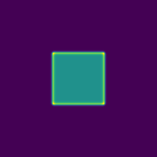
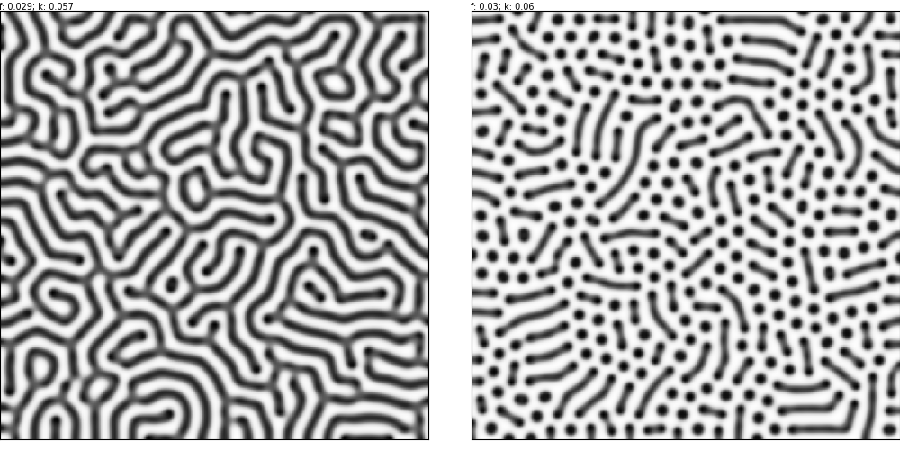

- Tools: Python
- Source code: [https://github.com/vec2pt/py-sketches](https://github.com/vec2pt/py-sketches)
- Links:
    - [Reaction–diffusion system](https://en.wikipedia.org/wiki/Reaction%E2%80%93diffusion_system)
    - [Gray-Scott Model of a Reaction-Diffusion System](https://itp.uni-frankfurt.de/~gros/StudentProjects/Projects_2020/projekt_schulz_kaefer/)
    - [Gray Scott Model of Reaction Diffusion](https://groups.csail.mit.edu/mac/projects/amorphous/GrayScott/)
    - [Reaction-Diffusion by the Gray-Scott Model: Pearson's Parametrization](https://www.mrob.com/pub/comp/xmorphia/index.html)




```python
import matplotlib
import matplotlib.animation as animation
import matplotlib.pyplot as plt
import numpy as np
from scipy import ndimage

matplotlib.use("TkAgg")


class GrayScottModel:
    """Gray-Scott Model"""

    def __init__(
        self,
        width: int = 50,
        height: int = 50,
        d_u: float = 0.01,
        d_v: float = 0.005,
        f: float = 0.029,
        k: float = 0.057,
        initiate_randomly: bool = False,
    ) -> None:
        """Gray-Scott Model

        Args:
            width (int, optional): Sample width. Defaults to 50.
            height (int, optional): Sample height. Defaults to 50.
            d_u (float, optional): U diffusion rate. Defaults to 0.01.
            d_v (float, optional): V diffusion rate. Defaults to 0.005.
            f (float, optional): Feed rate. Defaults to 0.029.
            k (float, optional): Kill rate. Defaults to 0.057.
            initiate_randomly (bool, optional): Initiate randomly. Defaults to False.
        """
        self._width = width
        self._height = height
        self._d_u = d_u
        self._d_v = d_v
        self._f = f
        self._k = k
        if initiate_randomly:
            mask = np.random.random((height, width))
            mask = mask < 0.3
        else:
            mask = np.full((height, width), False)
            mask[
                height // 3 + 1 : -height // 3, width // 3 + 1 : -width // 3
            ] = True
        self._apply_mask(mask)

    def _apply_mask(self, mask):
        self._u = np.ones((self._height, self._width))
        self._v = np.zeros((self._height, self._width))
        self._u[mask] = 0
        self._v[mask] = 1

    @property
    def u(self) -> np.ndarray:
        """Substanc U

        Returns:
            np.ndarray: Substanc U
        """
        return (self._u - self._u.min()) / (self._u.max() - self._u.min())

    @property
    def v(self) -> np.ndarray:
        """Substanc V

        Returns:
            np.ndarray: Substanc V
        """
        return (self._v - self._v.min()) / (self._v.max() - self._v.min())

    @classmethod
    def from_mask(
        cls,
        mask: np.ndarray,
        d_u: float = 0.01,
        d_v: float = 0.005,
        f: float = 0.029,
        k: float = 0.057,
    ):
        """Create Gray-Scott Model from mask.

        Args:
            mask (np.ndarray): Mask.
            d_u (float, optional): U diffusion rate. Defaults to 0.01.
            d_v (float, optional): V diffusion rate. Defaults to 0.005.
            f (float, optional): Feed rate. Defaults to 0.029.
            k (float, optional): Kill rate. Defaults to 0.057.

        Returns:
            GrayScottModel: Gray-Scott Model
        """
        height, width = mask.shape
        gray_scott_model = cls(width, height, d_u, d_v, f, k)
        gray_scott_model._apply_mask(mask)
        return gray_scott_model

    def compute(self):
        """Compute Gray-Scott Model"""
        self._u += (
            self._d_u * ndimage.laplace(self._u)
            - self._u * self._v * self._v
            + self._f * (1 - self._u)
        )
        self._v += (
            self._d_v * ndimage.laplace(self._v)
            + self._u * self._v * self._v
            - (self._f + self._k) * self._v
        )


if __name__ == "__main__":
    fig, ax = plt.subplots()
    ims = []

    gsm = GrayScottModel(100, 100, 0.1, 0.05)

    for i in range(5000):
        gsm.compute()
        if i % 100 == 0 and i != 0:
            im = ax.imshow(gsm.v, cmap="Greys", animated=True)
            ims.append([im])

    ani = animation.ArtistAnimation(
        fig, ims, interval=50, blit=True, repeat_delay=1000
    )
    plt.show()
```


