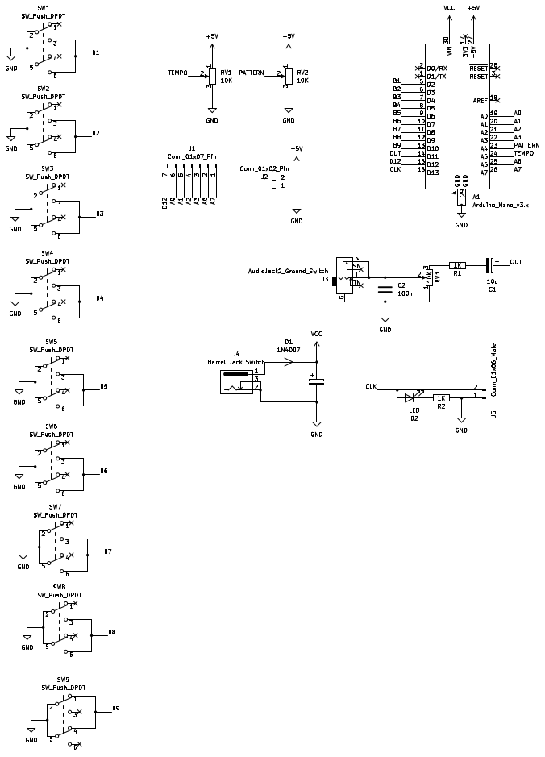
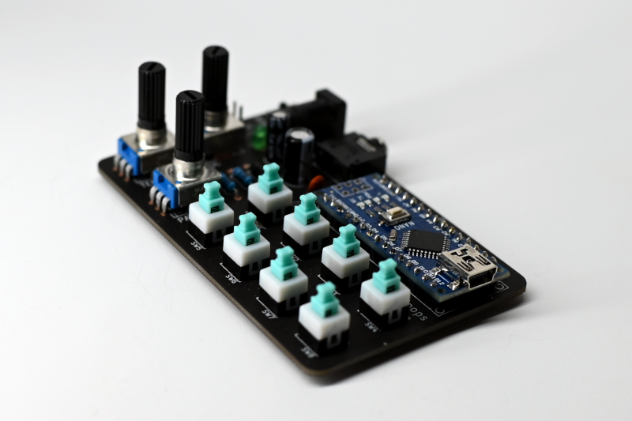
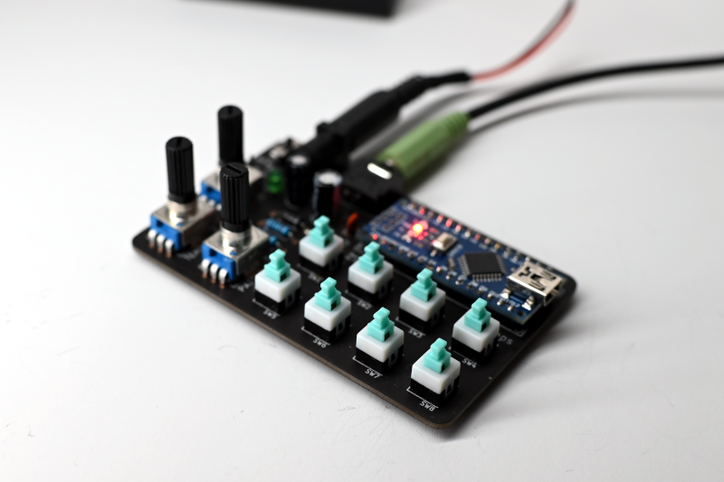

- Project stage: Prototype
- Tools: KiCad
- Vimeo: [Vimeo](https://vimeo.com/{{ site.vimeo_username }})
- Photos by: [Iza Rzechuła](https://www.iza.rzechula.pl/)
- Links:
    - [The O2 source code](https://web.archive.org/web/20170918125855/https://janostman.wordpress.com/the-o2-source-code/)
- Inspirations:
    - [Minipops by MakerVan Labs](https://wiki.makervan.de/wiki/Minipops)
    - [NANO-Minipops](https://github.com/NANOmodules/NANO-Minipops)

PCB for Jan Ostman’s Minipops. The ino file can be found in the repository: [Minipops-](https://github.com/Krustpunkhippy/Minipops-)

\* **NOTE**: This project was created for personal use only and is not commercial.

### Schematic

### Photos

### BoM

|#  |Reference                             |Qty|Value                   |Footprint                                                              |
|---|--------------------------------------|:-:|------------------------|-----------------------------------------------------------------------|
|1  |A1                                    |1  |Arduino_Nano_v3.x       |Arduino_Nano                                     |
|2  |C1                                    |1  |10u                     |CP_Radial_D5.0mm_P2.50mm                         |
|3  |C2                                    |1  |100n                    |C_Disc_D3.4mm_W2.1mm_P2.50mm                             |
|4  |C3                                    |1  |100u                    |CP_Radial_D6.3mm_P2.50mm                         |
|5  |D1                                    |1  |1N4007                  |D_A-405_P10.16mm                                  |
|6  |D2                                    |1  |LED                     |LED_D3.0mm                                                     |
|7  |J1                                    |1  |Conn_01x07_Pin          |PinHeader_1x07_P2.54mm             |
|8  |J2                                    |1  |Conn_01x02_Pin          |PinHeader_1x02_P2.54mm             |
|9  |J3                                    |1  |AudioJack2_Ground_Switch|AudioJack_3.5                                    |
|10 |J4                                    |1  |Barrel_Jack_Switch      |BarrelJack_54-00166                              |
|11 |J5                                    |1  |Conn_01x06_Male         |PinHeader_1x02_P2.54mm             |
|12 |R1, R2                                |2  |1K                      |R_Axial_DIN0207_L6.3mm_D2.5mm_P10.16mm|
|13 |RV1, RV2, RV3                         |3  |10K                     |Potentiometer_R9011                              |
|14 |SW1, SW2, SW3, SW4, SW5, SW6, SW7, SW8|8  |SW_Push_DPDT            |SW_Push_7x7                                      |
|15 |SW9                                   |1  |SW_Push_DPDT            |SW_Push_4x9                                      |

### Files
- [20231204-minipops-schematic.pdf](../assets/files/20231204-minipops-schematic.pdf)
- [20240313-minipops-gerber.zip](../assets/files/20240313-minipops-gerber.zip)
