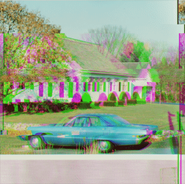

- Tools: Python
- Source code: [https://github.com/vec2pt/py-sketches](https://github.com/vec2pt/py-sketches)
- Inspirations:
    - [ImageGlitcher](https://www.airtightinteractive.com/demos/js/imageglitcher/)

\* Images used to test the code taken from the USC-SIPI Image Database.




```python
import matplotlib
import matplotlib.animation as animation
import matplotlib.pyplot as plt
import numpy as np
from PIL import Image

matplotlib.use("TkAgg")


class ImageGlitcher:
    """Image Glitcher"""

    def __init__(
        self,
        img_path: str,
        v_glitch: bool = True,
        v_intensity: float = 0.01,
        h_glitch: bool = True,
        h_intensity: float = 0.1,
        h_lines_count: int | None = None,
    ) -> None:
        """Image Glitcher

        Args:
            img_path (str): Image path.
            v_glitch (bool, optional): Vertical glitch. Defaults to True.
            v_intensity (float, optional): Intensity of vertical glitch. Defaults to 0.05.
            h_glitch (bool, optional): Horizontal glitch. Defaults to True.
            h_intensity (float, optional): Intensity of horizontal glitch. Defaults to 0.1.
            h_lines_count (int, optional): Number of horizontal glitch lines. Defaults to None.
        """
        img = Image.open(img_path)
        self._img = np.asarray(img.convert("RGB"))
        self._img_shape = self._img.shape

        self._v_glitch = v_glitch
        self._v_intensity = v_intensity
        self._h_glitch = h_glitch
        self._h_lines_count = (
            h_lines_count if h_lines_count else np.random.randint(2, 21)
        )
        self._h_intensity = h_intensity

    def _get_merged_channels(self, randomization: bool = True):
        if randomization:
            return np.random.choice(3, size=3, replace=True).tolist()
        return [0, 1, 2]

    def _get_random_transformation(self, line_length: int, intensity: float):
        return np.random.randint(
            -int((line_length + 1) * intensity / 2),
            int((line_length + 1) * intensity / 2),
        )

    def glitch(self) -> np.ndarray:
        """Glitch

        Returns:
            np.ndarray: Glitched image.
        """
        new_img = np.copy(self._img)
        new_img = np.moveaxis(new_img, -1, 0)

        # Vertical glitch
        if self._v_glitch:
            merged_channels = self._get_merged_channels()
            transformations = [
                self._get_random_transformation(
                    self._img_shape[0], self._v_intensity
                )
                for _ in range(3)
            ]
            for i in range(3):
                new_img[i] = np.roll(
                    new_img[i], transformations[merged_channels[i]], 0
                )

        # Horizontal glitch
        if self._h_glitch:
            horizontal_lines = np.sort(
                np.random.choice(
                    self._img_shape[0] + 1,
                    size=self._h_lines_count - 1,
                    replace=False,
                )
            ).tolist()

            # Common color scheme
            merged_channels = self._get_merged_channels()

            for a, b in zip(
                [0] + horizontal_lines, horizontal_lines + [self._img_shape[0]]
            ):
                transformations = [
                    self._get_random_transformation(
                        self._img_shape[1], self._h_intensity
                    )
                    for _ in range(3)
                ]

                # Random color scheme for each line
                # merged_channels = self._get_merged_channels()

                # Randomly glitches some lines
                if np.random.choice(2):
                    for i in range(3):
                        new_img[i][a:b] = np.roll(
                            new_img[i][a:b],
                            transformations[merged_channels[i]],
                            1,
                        )

                if np.random.choice(2):
                    for i in range(3):
                        for j in range(b - a):
                            new_img[i][a + j] = np.roll(
                                new_img[i][a + j],
                                int(np.sin(j * 4) * 5),  # WIP
                                0,
                            )
        return np.moveaxis(new_img, 0, -1)


if __name__ == "__main__":
    # np.random.seed(0)

    fig, ax = plt.subplots()
    ims = []

    image_glitcher = ImageGlitcher("house.tiff")

    for i in range(15):
        glitched_img = image_glitcher.glitch()
        im = ax.imshow(glitched_img, animated=True)
        ims.append([im])

    ani = animation.ArtistAnimation(
        fig, ims, interval=150, blit=True, repeat_delay=0
    )

    plt.show()
```
