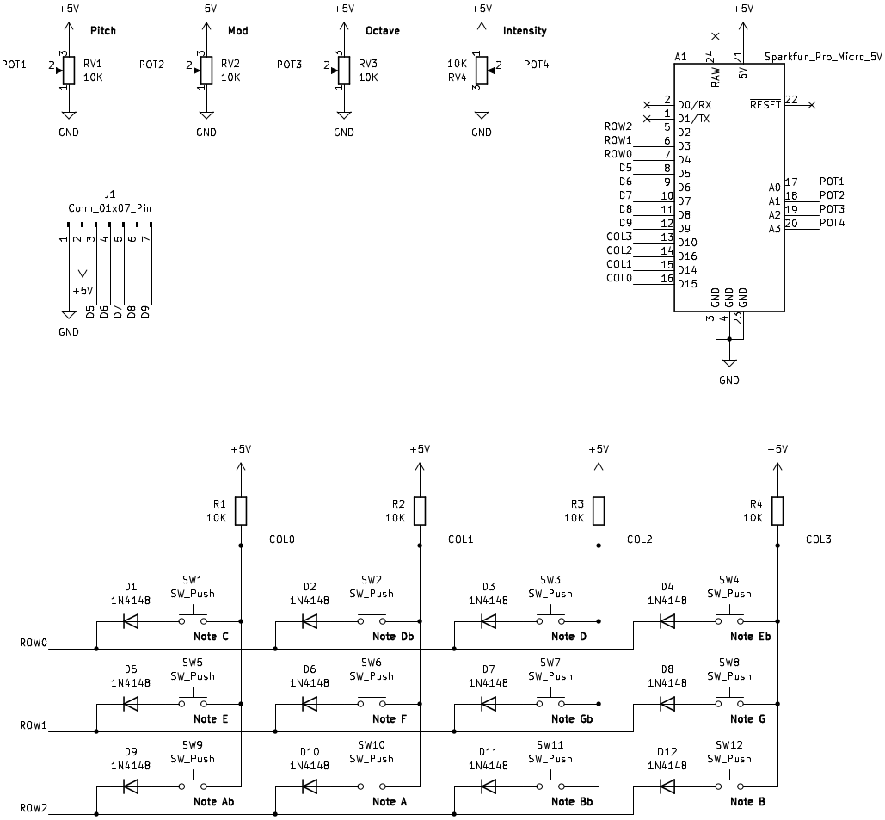
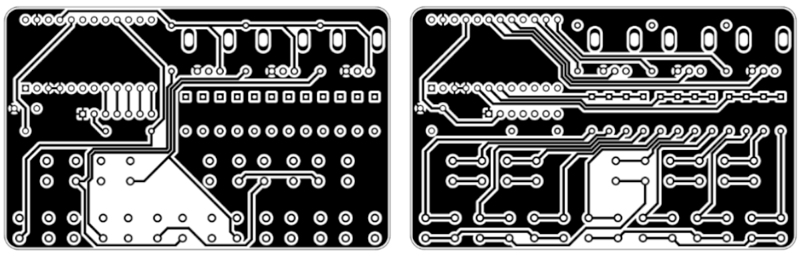

- Project stage: Prototype
- Tools: KiCad, Arduino

Mechanical one-octave MIDI keyboard with Pitch Wheel and Modulation Wheel. Microcontroller used: SparkFun Pro Micro - 5V/16MHz.

### Schematic



### BoM

| # | Reference                                                     | Qty | Value                 | Footprint                                         |
|---|---------------------------------------------------------------|:---:|-----------------------|---------------------------------------------------|
| 1 | A1                                                            | 1   | Sparkfun_Pro_Micro_5V | SparkFun_Pro_Micro                                |
| 2 | D1, D2, D3, D4, D5, D6, D7, D8, D9, D10, D11, D12             | 12  | 1N4148                | D_DO-35_SOD27_P7.62mm                  |
| 3 | J1                                                            | 1   | Conn_01x07_Pin        | PinHeader_1x07_P2.54mm                   |
| 4 | R1, R2, R3, R4                                                | 4   | 10K                   | R_Axial_DIN0207 |
| 5 | RV1, RV2, RV3                                                 | 3   | 10K                   | Potentiometer_R9011                               |
| 6 | RV4                                                           | 1   | 10K                   | Potentiometer_RM065                               |
| 7 | SW1, SW2, SW3, SW4, SW5, SW6, SW7, SW8, SW9, SW10, SW11, SW12 | 12  | SW_Push               | SW_PUSH_6mm_H4.3mm                                |

### Code

```cpp
/*
  MIDI Keyboard (M1) - Mechanical

  Version: 1.0
  Created: 20231227

  Mechanical one-octave MIDI keyboard with Pitch Wheel and Modulation Wheel.
  Microcontroller used: SparkFun Pro Micro - 5V/16MHz.

  Some parts of the code were taken from the Create a MIDI Device tutorial.
    https://docs.arduino.cc/tutorials/generic/midi-device

  Libraries used:
    MIDIUSB - https://github.com/arduino-libraries/MIDIUSB/tree/master
*/

#include "MIDIUSB.h"
#include "PitchToNote.h"

#define ROWS_COUNT 3
#define COLS_COUNT 4
#define NUM_BUTTONS ROWS_COUNT *COLS_COUNT

#define POT_PITCH 18      // A0
#define POT_MOD 19        // A1
#define POT_OCTAVE 20     // A2
#define POT_INTENSITY 21  // A3

#define MOD_THRESHOLD 3
#define PITCH_THRESHOLD 250

const uint8_t rowPins[ROWS_COUNT] = {2, 3, 4};
const uint8_t colPins[COLS_COUNT] = {15, 14, 16, 10};

const byte notePitches[7][NUM_BUTTONS] = {
    {NOTE_C1, NOTE_D1b, NOTE_D1, NOTE_E1b, NOTE_E1, NOTE_F1, NOTE_G1b, NOTE_G1,
     NOTE_A1b, NOTE_A1, NOTE_B1b, NOTE_B1},
    {NOTE_C2, NOTE_D2b, NOTE_D2, NOTE_E2b, NOTE_E2, NOTE_F2, NOTE_G2b, NOTE_G2,
     NOTE_A2b, NOTE_A2, NOTE_B2b, NOTE_B2},
    {NOTE_C3, NOTE_D3b, NOTE_D3, NOTE_E3b, NOTE_E3, NOTE_F3, NOTE_G3b, NOTE_G3,
     NOTE_A3b, NOTE_A3, NOTE_B3b, NOTE_B3},
    {NOTE_C4, NOTE_D4b, NOTE_D4, NOTE_E4b, NOTE_E4, NOTE_F4, NOTE_G4b, NOTE_G4,
     NOTE_A4b, NOTE_A4, NOTE_B4b, NOTE_B4},
    {NOTE_C5, NOTE_D5b, NOTE_D5, NOTE_E5b, NOTE_E5, NOTE_F5, NOTE_G5b, NOTE_G5,
     NOTE_A5b, NOTE_A5, NOTE_B5b, NOTE_B5},
    {NOTE_C6, NOTE_D6b, NOTE_D6, NOTE_E6b, NOTE_E6, NOTE_F6, NOTE_G6b, NOTE_G6,
     NOTE_A6b, NOTE_A6, NOTE_B6b, NOTE_B6},
    {NOTE_C7, NOTE_D7b, NOTE_D7, NOTE_E7b, NOTE_E7, NOTE_F7, NOTE_G7b, NOTE_G7,
     NOTE_A7b, NOTE_A7, NOTE_B7b, NOTE_B7}};

bool buttonsState[NUM_BUTTONS];
bool buttonsStatePrevious[NUM_BUTTONS];

long actualPitchBendVal = 0;
long previousPitchBendVal = 0;
uint8_t actualModWheelVal = 0;
uint8_t previousModWheelVal = 0;
uint8_t actualOctave = 3;
uint8_t previousOctave = 3;
uint8_t intensity = 127;

void setup() {
  for (byte i = 0; i < COLS_COUNT; i++) {
    pinMode(colPins[i], INPUT_PULLUP);
  }
}

void loop() {
  readButtons();
  readPotentiometers();
  playNotes();
}

void readButtons() {
  int buttonIndex = 0;

  for (byte i = 0; i < ROWS_COUNT; i++) {
    pinMode(rowPins[i], OUTPUT);
    digitalWrite(rowPins[i], LOW);

    for (byte j = 0; j < COLS_COUNT; j++) {
      bool keyState = digitalRead(colPins[j]) == LOW;
      buttonsState[buttonIndex] = keyState;
      buttonIndex++;
    }
    pinMode(rowPins[i], INPUT);
  }
}

void readPotentiometers() {
  int actualPitchBendVal = map(analogRead(POT_PITCH), 10, 1013, 3, 16380);
  if ((actualPitchBendVal < previousPitchBendVal - PITCH_THRESHOLD) ||
      (actualPitchBendVal > previousPitchBendVal + PITCH_THRESHOLD)) {
    if (actualPitchBendVal <= PITCH_THRESHOLD) {
      actualPitchBendVal = 0;
    } else if (actualPitchBendVal >= 16383 - PITCH_THRESHOLD) {
      actualPitchBendVal = 16383;
    } else if ((actualPitchBendVal >= 8192 - PITCH_THRESHOLD) &&
               (actualPitchBendVal <= 8192 + PITCH_THRESHOLD)) {
      actualPitchBendVal = 8192;
    }
    pitchBend(0, actualPitchBendVal);
    MidiUSB.flush();
    previousPitchBendVal = actualPitchBendVal;
  }

  int actualModWheelVal = map(analogRead(POT_MOD), 10, 1013, 0, 127);
  if ((actualModWheelVal < previousModWheelVal - MOD_THRESHOLD) ||
      (actualModWheelVal > previousModWheelVal + MOD_THRESHOLD)) {
    if (actualModWheelVal <= MOD_THRESHOLD) {
      actualModWheelVal = 0;
    } else if (actualModWheelVal >= 127 - MOD_THRESHOLD) {
      actualModWheelVal = 127;
    }
    controlChange(0, 1, actualModWheelVal);
    MidiUSB.flush();
    previousModWheelVal = actualModWheelVal;
  }

  previousOctave = actualOctave;
  int octaveVal = analogRead(POT_OCTAVE);
  actualOctave = (uint8_t)(map(octaveVal, 0, 1023, 0, 6));

  int intensityVal = analogRead(POT_INTENSITY);
  intensity = (uint8_t)(map(intensityVal, 0, 1023, 0, 127));
}

void playNotes() {
  for (int i = 0; i < NUM_BUTTONS; i++) {
    if (buttonsState[i] != buttonsStatePrevious[i]) {
      if (buttonsState[i]) {
        noteOn(0, notePitches[actualOctave][i], intensity);
        MidiUSB.flush();
      } else {
        noteOff(0, notePitches[actualOctave][i], 0);
        MidiUSB.flush();
      }
    }
    if (previousOctave != actualOctave) {
      noteOff(0, notePitches[previousOctave][i], 0);
      MidiUSB.flush();
    }
    buttonsStatePrevious[i] = buttonsState[i];
  }
}

void noteOn(byte channel, byte pitch, byte velocity) {
  midiEventPacket_t event = {0x09, 0x90 | channel, pitch, velocity};
  MidiUSB.sendMIDI(event);
}

void noteOff(byte channel, byte pitch, byte velocity) {
  midiEventPacket_t event = {0x08, 0x80 | channel, pitch, velocity};
  MidiUSB.sendMIDI(event);
}

void controlChange(byte channel, byte control, byte value) {
  midiEventPacket_t event = {0x0B, 0xB0 | channel, control, value};
  MidiUSB.sendMIDI(event);
}

void pitchBend(byte channel, int value) {
  // https://github.com/rkistner/arcore/issues/19
  byte lowValue = value & 0x7F;
  byte highValue = value >> 7;
  midiEventPacket_t event = {0x0E, 0xE0 | channel, lowValue, highValue};
  MidiUSB.sendMIDI(event);
}
```

### PCB



\* The PCB has not been manufactured.


### Files
- [20231227-midi-keyboard-m1-schematic.pdf](../assets/files/20231227-midi-keyboard-m1-schematic.pdf)
- [20231227-midi-keyboard-m1-ino.zip](../assets/files/20231227-midi-keyboard-m1-ino.zip)
