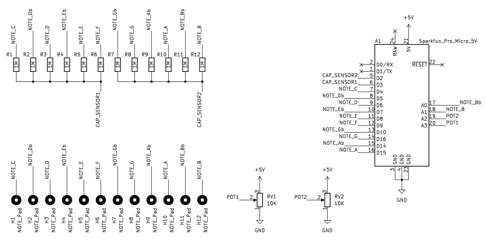

- Project stage: Prototype
- Tools: KiCad, Arduino
- Photos by: [Iza Rzechuła](https://www.iza.rzechula.pl/)


Touch-sensitive, one-octave MIDI keyboard with Modulation Wheel. Microcontroller used: SparkFun Pro Micro - 5V/16MHz.

### Schematic




### Bill of Materials (BOM)

|#  |Reference                                        |Qty|Value                |Footprint                                                              |
|---|-------------------------------------------------|:-:|---------------------|-----------------------------------------------------------------------|
|1  |A1                                               |1  |Sparkfun_Pro_Micro_5V|SparkFun_Pro_Micro                               |
|2  |H1, H2, H3, H4, H5, H6, H7, H8, H9, H10, H11, H12|12 |NOTE_Pad             |Pin_D1.0mm                                       |
|3  |R1, R2, R3, R4, R5, R6, R7, R8, R9, R10, R11, R12|12 |1M                   |R_Axial_DIN0207 |
|4  |RV1, RV2                                         |2  |10K                  |Potentiometer_R9011                              |


### Code

```cpp
/*
  Touch MIDI Keyboard (C1)

  Version: 1.0
  Created: 20231228

  Touch-sensitive, one-octave MIDI keyboard with Modulation Wheel.
  Microcontroller used: SparkFun Pro Micro - 5V/16MHz.

  Some parts of the code were taken from the Create a MIDI Device tutorial.
    https://docs.arduino.cc/tutorials/generic/midi-device

  Libraries used:
    CapacitiveSensor - https://github.com/PaulStoffregen/CapacitiveSensor
    MIDIUSB - https://github.com/arduino-libraries/MIDIUSB
*/

#include "CapacitiveSensor.h"
#include "MIDIUSB.h"
#include "PitchToNote.h"

#define CAP_SENSOR_SEND1 3
#define CAP_SENSOR_SEND2 2
#define POT_MOD 20     // A2
#define POT_OCTAVE 21  // A3

#define NUM_BUTTONS 12
#define CAP_SENSOR_THRESHOLD 150
#define CAP_SENSOR_SAMPLES 30
#define MOD_THRESHOLD 3
#define INTENSITY 127

const bool debugging = false;

const byte notePitches[7][NUM_BUTTONS] = {
    {NOTE_C1, NOTE_D1b, NOTE_D1, NOTE_E1b, NOTE_E1, NOTE_F1, NOTE_G1b, NOTE_G1,
     NOTE_A1b, NOTE_A1, NOTE_B1b, NOTE_B1},
    {NOTE_C2, NOTE_D2b, NOTE_D2, NOTE_E2b, NOTE_E2, NOTE_F2, NOTE_G2b, NOTE_G2,
     NOTE_A2b, NOTE_A2, NOTE_B2b, NOTE_B2},
    {NOTE_C3, NOTE_D3b, NOTE_D3, NOTE_E3b, NOTE_E3, NOTE_F3, NOTE_G3b, NOTE_G3,
     NOTE_A3b, NOTE_A3, NOTE_B3b, NOTE_B3},
    {NOTE_C4, NOTE_D4b, NOTE_D4, NOTE_E4b, NOTE_E4, NOTE_F4, NOTE_G4b, NOTE_G4,
     NOTE_A4b, NOTE_A4, NOTE_B4b, NOTE_B4},
    {NOTE_C5, NOTE_D5b, NOTE_D5, NOTE_E5b, NOTE_E5, NOTE_F5, NOTE_G5b, NOTE_G5,
     NOTE_A5b, NOTE_A5, NOTE_B5b, NOTE_B5},
    {NOTE_C6, NOTE_D6b, NOTE_D6, NOTE_E6b, NOTE_E6, NOTE_F6, NOTE_G6b, NOTE_G6,
     NOTE_A6b, NOTE_A6, NOTE_B6b, NOTE_B6},
    {NOTE_C7, NOTE_D7b, NOTE_D7, NOTE_E7b, NOTE_E7, NOTE_F7, NOTE_G7b, NOTE_G7,
     NOTE_A7b, NOTE_A7, NOTE_B7b, NOTE_B7}};

bool actualButtonsState[NUM_BUTTONS];
bool previousButtonsState[NUM_BUTTONS];

uint8_t actualOctave = 3;
uint8_t previousOctave = 3;
uint8_t actualModWheelVal = 0;
uint8_t previousModWheelVal = 0;

CapacitiveSensor buttons[NUM_BUTTONS] = {
    CapacitiveSensor(CAP_SENSOR_SEND1, 4),    // C
    CapacitiveSensor(CAP_SENSOR_SEND1, 5),    // Db
    CapacitiveSensor(CAP_SENSOR_SEND1, 6),    // D
    CapacitiveSensor(CAP_SENSOR_SEND1, 7),    // Eb
    CapacitiveSensor(CAP_SENSOR_SEND1, 8),    // E
    CapacitiveSensor(CAP_SENSOR_SEND1, 9),    // F
    CapacitiveSensor(CAP_SENSOR_SEND2, 10),   // Gb
    CapacitiveSensor(CAP_SENSOR_SEND2, 16),   // G
    CapacitiveSensor(CAP_SENSOR_SEND2, 14),   // Ab
    CapacitiveSensor(CAP_SENSOR_SEND2, 15),   // A
    CapacitiveSensor(CAP_SENSOR_SEND2, 18),   // Bb
    CapacitiveSensor(CAP_SENSOR_SEND2, 19)};  // B

void setup() {
  if (debugging) {
    Serial.begin(115200);
  }
  // for (int i = 0; i < NUM_BUTTONS; i++) {
  //   buttons[i].set_CS_AutocaL_Millis(0xFFFFFFFF);
  // }
}

void loop() {
  readButtons();
  if (!debugging) {
    readPotentiometers();
    playNotes();
  }
}

void readButtons() {
  for (int i = 0; i < NUM_BUTTONS; i++) {
    actualButtonsState[i] = (buttons[i].capacitiveSensor(CAP_SENSOR_SAMPLES) >
                             CAP_SENSOR_THRESHOLD);
  }
  if (debugging) {
    for (int i = 0; i < NUM_BUTTONS; i++) {
      Serial.print(actualButtonsState[i]);
      Serial.print("  ");
    }
    Serial.println("  ");
  }
}

void readPotentiometers() {
  int actualModWheelVal = map(analogRead(POT_MOD), 10, 1013, 0, 127);
  if ((actualModWheelVal < previousModWheelVal - MOD_THRESHOLD) ||
      (actualModWheelVal > previousModWheelVal + MOD_THRESHOLD)) {
    if (actualModWheelVal <= MOD_THRESHOLD) {
      actualModWheelVal = 0;
    } else if (actualModWheelVal >= 127 - MOD_THRESHOLD) {
      actualModWheelVal = 127;
    }
    controlChange(0, 1, actualModWheelVal);
    MidiUSB.flush();
    previousModWheelVal = actualModWheelVal;
  }

  previousOctave = actualOctave;
  int octaveVal = analogRead(POT_OCTAVE);
  actualOctave = (uint8_t)(map(octaveVal, 0, 1023, 0, 6));
}

void playNotes() {
  for (int i = 0; i < NUM_BUTTONS; i++) {
    if (actualButtonsState[i] != previousButtonsState[i]) {
      if (actualButtonsState[i]) {
        noteOn(0, notePitches[actualOctave][i], INTENSITY);
        MidiUSB.flush();
      } else {
        noteOff(0, notePitches[actualOctave][i], 0);
        MidiUSB.flush();
      }
      previousButtonsState[i] = actualButtonsState[i];
    }
    if (previousOctave != actualOctave) {
      noteOff(0, notePitches[previousOctave][i], 0);
      MidiUSB.flush();
    }
  }
}

void noteOn(byte channel, byte pitch, byte velocity) {
  midiEventPacket_t noteOn = {0x09, 0x90 | channel, pitch, velocity};
  MidiUSB.sendMIDI(noteOn);
}

void noteOff(byte channel, byte pitch, byte velocity) {
  midiEventPacket_t noteOff = {0x08, 0x80 | channel, pitch, velocity};
  MidiUSB.sendMIDI(noteOff);
}

void controlChange(byte channel, byte control, byte value) {
  midiEventPacket_t event = {0x0B, 0xB0 | channel, control, value};
  MidiUSB.sendMIDI(event);
}
```

### Photos


### PCB Design


### Files
- [20231228-midi-keyboard-c1-schematic.pdf](../assets/files/20231228-midi-keyboard-c1-schematic.pdf)
- [20231228-midi-keyboard-c1-ino.zip](../assets/files/20231228-midi-keyboard-c1-ino.zip)
- [20231228-midi-keyboard-c1-gerber.zip](../assets/files/20231228-midi-keyboard-c1-gerber.zip)
