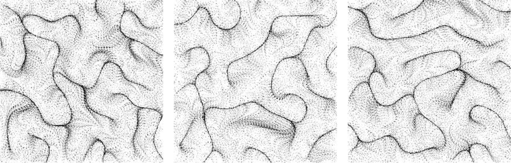

- Tools: Python
- Source code: [https://github.com/vec2pt/py-sketches](https://github.com/vec2pt/py-sketches)
- Links:
    - [OpenSimplex noise](https://en.wikipedia.org/wiki/OpenSimplex_noise)
    - [`opensimplex` for Python](https://pypi.org/project/opensimplex/)


```python
import matplotlib
import matplotlib.pyplot as plt
import numpy as np
import opensimplex

matplotlib.use("TkAgg")


def opensimplex_flow_fields(
    width: int = 512,
    height: int = 512,
    particles_count: int = 3000,
    generations: int = 500,
    noise_scale: float = 5.0,
    particles_step: float = 5.0,
    particles_opacity: float = 0.99,
) -> np.ndarray:
    """OpenSimplex Flow Fields

    Args:
        width (int, optional): Width. Defaults to 512.
        height (int, optional): Height. Defaults to 512.
        particles_count (int, optional): Particles count. Defaults to 3000.
        generations (int, optional): Generations. Defaults to 500.
        noise_scale (float, optional): Noise scale. Defaults to 5.0.
        particles_step (float, optional): Particles step. Defaults to 5.0.
        particles_opacity (float, optional): Particles opacity. Defaults to 0.99.

    Returns:
        np.ndarray: OpenSimplex Flow Fields result
    """
    shape = (height, width)
    x, y = (
        np.linspace(0.0, 1.0, shape[1]) * noise_scale * shape[1] / min(shape),
        np.linspace(0.0, 1.0, shape[0]) * noise_scale * shape[0] / min(shape),
    )
    noise = opensimplex.noise2array(x, y)
    particles_coords = np.array(
        [
            np.random.randint(0, height, size=particles_count),
            np.random.randint(0, width, size=particles_count),
        ]
    )

    img = np.zeros(shape=shape)
    img[*particles_coords] = 1

    for _ in range(generations):
        img *= particles_opacity
        noise_val = noise[*particles_coords] * 2 * np.pi
        new_particles_coords = particles_coords + np.round(
            np.array([np.cos(noise_val), np.sin(noise_val)]) * particles_step
        ).astype(np.int64)

        random_coords = np.array(
            [
                np.random.randint(0, height, size=particles_count),
                np.random.randint(0, width, size=particles_count),
            ]
        )
        new_particles_coords = np.where(
            (new_particles_coords[0] >= height)
            | (new_particles_coords[1] >= width)
            | (new_particles_coords[0] < 0)
            | (new_particles_coords[1] < 0),
            random_coords,
            new_particles_coords,
        )

        particles_coords = new_particles_coords
        img[*particles_coords] = 1
    return img


if __name__ == "__main__":
    opensimplex.seed(42)

    result = opensimplex_flow_fields()
    plt.imshow(abs(result - 1), cmap="gray", vmin=0, vmax=1)
    plt.show()
```


