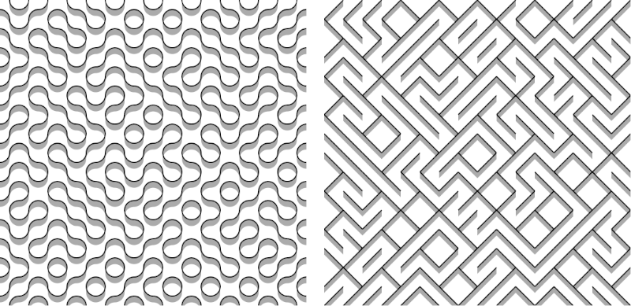

- Tools: Python
- Source code: [https://github.com/vec2pt/py-sketches](https://github.com/vec2pt/py-sketches)
- Links:
    - [Wikipedia - Truchet tiles](https://en.wikipedia.org/wiki/Truchet_tiles)

```python
import random

import drawsvg as dw


def truchet_tiles(
    w_tiles_count: int = 16,
    h_tiles_count: int = 16,
    variation: str = "quarter-circles",
    tile_size: int = 32,
    fname: str = "truchet_tiles.svg",
) -> None:
    """Truchet tiles

    Args:
        w_tiles_count (int, optional): Width tiles count. Defaults to 16.
        h_tiles_count (int, optional): Height tiles count. Defaults to 16.
        variation (str, optional): Variation. Acceptable : 'diagonal' and 'quarter-circles'. Defaults to 'quarter-circles'.
        tile_size (int, optional): Tile size in pixels. Defaults to 32.
        fname (str, optional): Output file name (svg). Defaults to "truchet_tiles.svg".

    Raises:
        ValueError: Unexpected variation.
    """

    shadow_size = tile_size / 3

    d = dw.Drawing(
        tile_size * w_tiles_count, tile_size * h_tiles_count, id_prefix="pic"
    )

    # Create SVG defs
    if variation == "diagonal":
        group_a = dw.Group()
        wall = dw.Line(
            0, 0, tile_size, tile_size, stroke="black", stroke_width=2
        )
        shadow = dw.Lines(
            0,
            shadow_size,
            0,
            0,
            tile_size,
            tile_size,
            tile_size,
            tile_size + shadow_size,
            close=True,
            fill="#ababab",
        )
        group_a.append(shadow)
        group_a.append(wall)

        group_b = dw.Group()
        wall = dw.Line(
            0, tile_size, tile_size, 0, stroke="black", stroke_width=2
        )
        shadow = dw.Lines(
            0,
            tile_size + shadow_size,
            0,
            tile_size,
            tile_size,
            0,
            tile_size,
            shadow_size,
            close=True,
            fill="#ababab",
        )
        group_b.append(shadow)
        group_b.append(wall)

    elif variation == "quarter-circles":
        group_a = dw.Group()
        wall1 = dw.ArcLine(
            0,
            0,
            tile_size / 2,
            270,
            360,
            stroke="black",
            stroke_width=2,
            fill="none",
        )
        wall2 = dw.ArcLine(
            tile_size,
            tile_size,
            tile_size / 2,
            90,
            180,
            stroke="black",
            stroke_width=2,
            fill="none",
        )
        shadow1 = dw.Path(fill="#ababab")
        group_a.append(
            shadow1.M(tile_size, tile_size / 2)
            .A(
                tile_size / 2,
                tile_size / 2,
                rot=0,
                large_arc=0,
                sweep=0,
                ex=tile_size / 2,
                ey=tile_size,
            )
            .L(tile_size / 2, tile_size + shadow_size)
            .A(
                tile_size / 2,
                tile_size / 2,
                rot=0,
                large_arc=0,
                sweep=1,
                ex=tile_size,
                ey=tile_size / 2 + shadow_size,
            )
            .L(tile_size, tile_size / 2)
        )
        shadow2 = dw.Path(fill="#ababab")
        group_a.append(
            shadow2.M(0, tile_size / 2)
            .A(
                tile_size / 2,
                tile_size / 2,
                rot=0,
                large_arc=0,
                sweep=0,
                ex=tile_size / 2,
                ey=0,
            )
            .L(tile_size / 2, shadow_size)
            .A(
                tile_size / 2,
                tile_size / 2,
                rot=0,
                large_arc=0,
                sweep=1,
                ex=0,
                ey=tile_size / 2 + shadow_size,
            )
            .L(0, tile_size / 2)
        )
        group_a.append(wall1)
        group_a.append(wall2)

        group_b = dw.Group()
        wall1 = dw.ArcLine(
            0,
            tile_size,
            tile_size / 2,
            0,
            90,
            stroke="black",
            stroke_width=2,
            fill="none",
        )
        wall2 = dw.ArcLine(
            tile_size,
            0,
            tile_size / 2,
            180,
            270,
            stroke="black",
            stroke_width=2,
            fill="none",
        )
        shadow1 = dw.Path(fill="#ababab")
        group_b.append(
            shadow1.M(tile_size / 2, 0)
            .A(
                tile_size / 2,
                tile_size / 2,
                rot=0,
                large_arc=0,
                sweep=0,
                ex=tile_size,
                ey=tile_size / 2,
            )
            .L(tile_size, tile_size / 2 + shadow_size)
            .A(
                tile_size / 2,
                tile_size / 2,
                rot=0,
                large_arc=0,
                sweep=1,
                ex=tile_size / 2,
                ey=0 + shadow_size,
            )
            .L(tile_size / 2, 0)
        )

        shadow2 = dw.Path(fill="#ababab")
        group_b.append(
            shadow2.M(tile_size / 2, tile_size)
            .A(
                tile_size / 2,
                tile_size / 2,
                rot=0,
                large_arc=0,
                sweep=0,
                ex=0,
                ey=tile_size / 2,
            )
            .L(0, tile_size / 2 + shadow_size)
            .A(
                tile_size / 2,
                tile_size / 2,
                rot=0,
                large_arc=0,
                sweep=1,
                ex=tile_size / 2,
                ey=tile_size + shadow_size,
            )
            .L(tile_size / 2, tile_size)
        )

        group_b.append(wall1)
        group_b.append(wall2)
    else:
        raise ValueError(f"Unexpected variation: '{variation}'.")

    indexes = [
        (a, b) for b in range(h_tiles_count) for a in range(w_tiles_count)
    ]
    for i, j in indexes:
        if bool(random.getrandbits(1)):
            d.append(dw.Use(group_a, tile_size * i, tile_size * j))
        else:
            d.append(dw.Use(group_b, tile_size * i, tile_size * j))

    d.save_svg(fname)


if __name__ == "__main__":
    truchet_tiles(variation="quarter-circles")
```


