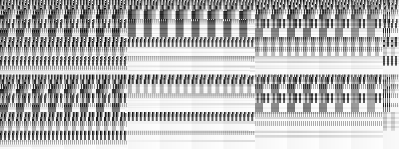
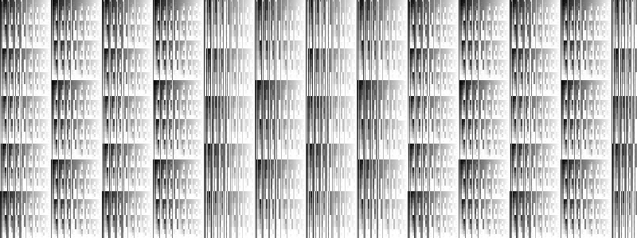
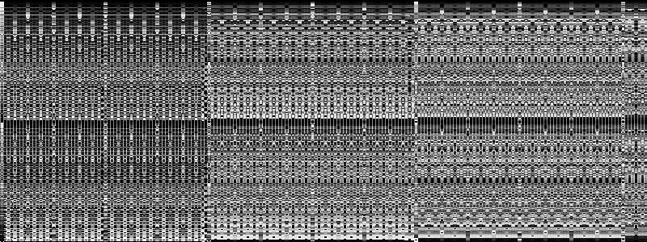

- Tools: Python
- Source code: [https://github.com/vec2pt/py-sketches](https://github.com/vec2pt/py-sketches)
- Links:
    - [Bytebeat](http://canonical.org/~kragen/bytebeat/)

```python
import itertools
import math
from pathlib import Path
from typing import Callable

import numpy as np
import scipy.io.wavfile
from PIL import Image


def _create_sound_data(
    bytebeat_func: Callable, duration: float = 2, sampling_rate: int = 8000
) -> np.ndarray:
    """Creates sound data from bytebeat function.

    Args:
        bytebeat_func (Callable): Bytebeat function.
        duration (float, optional): Sound length in seconds. Defaults to 2.
        sampling_rate (int, optional): Sampling frequency. Defaults to 8000.

    Returns:
        np.ndarray: Sound data
    """
    t = np.arange(0, sampling_rate * duration) / sampling_rate
    sound_data = np.array([bytebeat_func(int(i * sampling_rate)) for i in t])
    return sound_data.astype(np.uint8)


def generate_img(
    bytebeat_func: Callable,
    filename: str | Path = "bytebeat.png",
    width: int = 512,
    height: int = 512,
    scale: int = 256,
    sampling_rate: int = 8000,
) -> None:
    """Generates image from bytebeat function.

    Args:
        bytebeat_func (Callable): Bytebeat function.
        filename (str | Path, optional): Filename. Defaults to "bytebeat.png".
        width (int, optional): Image width. Defaults to 512.
        height (int, optional): Image height. Defaults to 512.
        scale (int, optional): Scope zoom factor. Defaults to 256.
        sampling_rate (int, optional): Sampling frequency. Defaults to 8000.
    """
    duration = math.ceil(height * width / (sampling_rate * (height / scale)))
    sound = _create_sound_data(bytebeat_func, duration, sampling_rate)
    img_data = np.zeros((height, width), dtype=np.uint8)
    for x, y in itertools.product(range(width), range(height)):
        sample_index = math.floor((x * height + y) * scale / height)
        img_data[y][x] = sound[sample_index]
    img = Image.fromarray(img_data)
    img.save(filename)


def generate_wav(
    bytebeat_func: Callable,
    filename: str = "bytebeat.wav",
    duration: float = 2,
    sampling_rate: int = 8000,
) -> None:
    """Generates wav file from bytebeat function.

    Args:
        bytebeat_func (Callable): Bytebeat function.
        filename (str, optional): Filename. Defaults to "bytebeat.wav".
        duration (float, optional): Sound length in seconds. Defaults to 2.
        sampling_rate (int, optional): Sampling frequency. Defaults to 8000.
    """
    sound = _create_sound_data(bytebeat_func, duration, sampling_rate)
    scipy.io.wavfile.write(filename, sampling_rate, sound)


if __name__ == "__main__":
    # Exampes from https://dollchan.net/bytebeat

    # Noisy beats by tejeez
    example_1 = lambda t: ((-t & 4095) * (255 & t * (t & t >> 13)) >> 12) + (
        127 & t * (234 & t >> 8 & t >> 3) >> (3 & t >> 14)
    )

    # remix of miiro's 1-line symphony by stephth
    example_2 = lambda t: 9 * t & t >> 4 | 5 * t & t >> 7 | 3 * t & t >> 10

    # Good old fractal melody by Blueberry
    example_3 = lambda t: (t >> 9 ^ (t >> 9) - 1 ^ 1) % 13 * t

    generate_img(example_1)
    generate_wav(example_1)
```






