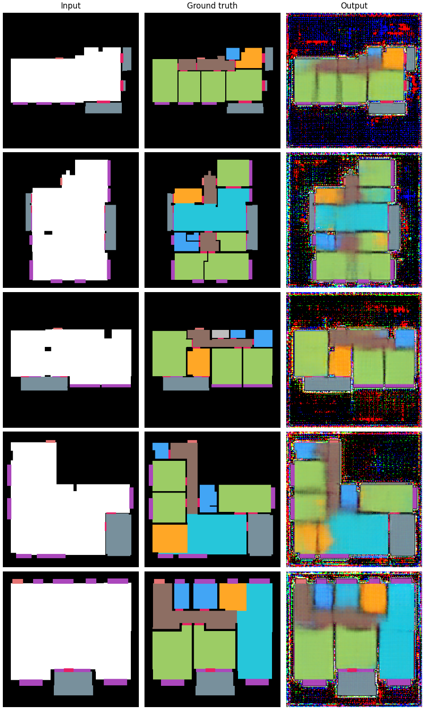

### Summary

The purpose of this project is to design and analyze a method for generating apartment layouts using GAN generative networks, which can find application in real estate analysis and be a supporting tool for designers and architects.

The Swiss Dwellings dataset [[1]](#1) was used for the project. One of the tasks was to analyze and prepare the dataset for the project. This work consisted of filtering out residential units from the dataset, validating the correctness of information about individual apartments, and transforming the tabular data into a image for learning.

The main task was to develop and adapt the Pix2Pix-type GAN model proposed by Philipp Isola, Jun-Yan Zhu, Tinghui Zhou and Alexej A. Efros in the article “Image-to-Image Translation with Conditional Adversarial Networks” [[2]](#2). The entire proposed architecture consists of a U-Net-type generator and a PatchGAN-type discriminator [[3]](#3).

Training lasted about 12 hours and took place on an NVIDIA GeForce RTX 4090 graphics card. The entire training process was broken into 3 stages (about 4 hours each), with 500 epochs per stage.

### Results

### References

<a id="1">[1]</a>
Standfest, Matthias, Michael Franzen, Yvonne Schröder, Luis Gonzalez Medina, Yarilo Villanueva
Hernandez, Jan Hendrik Buck, Yen-Ling Tan, Milena Niedzwiecka, and Rachele Colmegna. 2023.
“Swiss Dwellings: A large dataset of apartment models including aggregated geolocation-based
simulation results covering viewshed, natural light, traffic noise, centrality and geometric analysis.”
Zenodo. https://doi.org/10.5281/zenodo.7788422.

<a id="2">[2]</a>
Isola, Phillip, Jun-Yan Zhu, Tinghui Zhou, and Alexei A. Efros. 2018. “Image-to-Image Translation
with Conditional Adversarial Networks.” https://arxiv.org/abs/1611.07004.

<a id="3">[3]</a>
Demir, Ugur, and Gozde Unal. 2018. “Patch-Based Image Inpainting with Generative Adversarial
Networks.” https://arxiv.org/abs/1803.07422.
