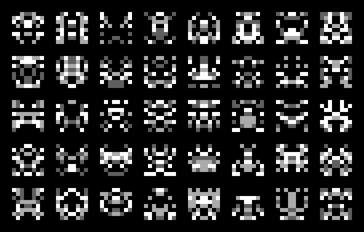

- Tools: Python
- Source code: [https://github.com/vec2pt/py-sketches](https://github.com/vec2pt/py-sketches)
- Inspirations:
    - [0x00/spaceinvadergenerator](https://github.com/0x00/spaceinvadergenerator)

```python
import numpy as np
from PIL import Image


def space_invader(
    size: tuple[int, int],
    palette: list[tuple[int, int, int]],
    weights: list[float] | None = None,
    scale: int = 1,
) -> Image.Image:
    """Space Invader Generator.

    Args:
        size (tuple[int, int]): A 2-tuple, containing (width, height).
        palette (list[tuple[int, int, int]]): Palette
        weights (list[float] | None, optional): Weights. Defaults to None.
        scale (int, optional): Image scale. Defaults to 1.

    Returns:
        Image.Image: Invader image.
    """
    map_i = np.random.choice(
        np.arange(len(palette)), (int(size[0] / 2), size[1]), p=weights
    )
    if size[0] % 2 != 1:
        map_i = np.concatenate((map_i, np.flipud(map_i)), axis=0).T
    else:
        map_i_axis = np.random.choice(
            np.arange(len(palette)), (1, size[1]), p=weights
        )
        map_i = np.concatenate((map_i, map_i_axis, np.flipud(map_i)), axis=0).T

    img_array = np.zeros((size[1], size[0], 3), dtype=np.uint8)
    for i, color in enumerate(palette):
        img_array[map_i == i] = color
    img = Image.fromarray(img_array, "RGB")
    return img.resize((size[0] * scale, size[1] * scale), Image.Resampling.BOX)


if __name__ == "__main__":
    palette = [(0, 0, 0), (95, 95, 95), (170, 170, 170), (255, 255, 255)]
    space_invader_img = space_invader(
        size=(8, 8), palette=palette, weights=[0.6, 0.1, 0.1, 0.2], scale=8
    )
    space_invader_img.save("invader.png")
```


