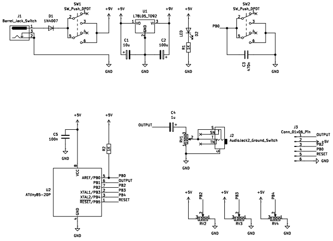
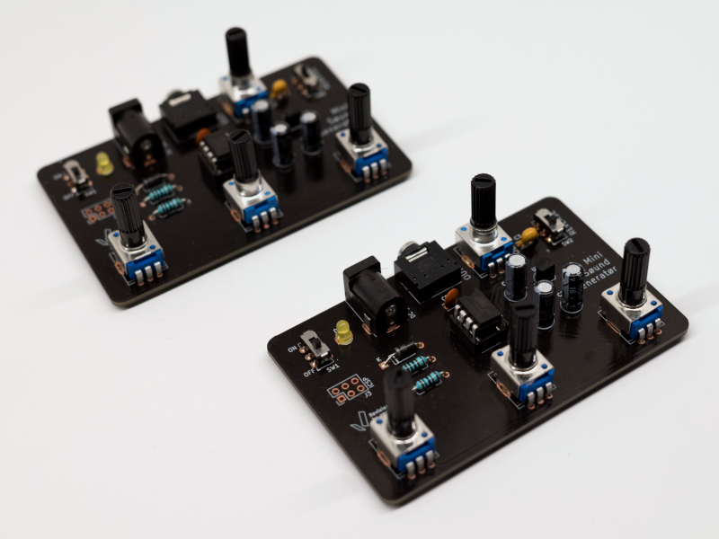
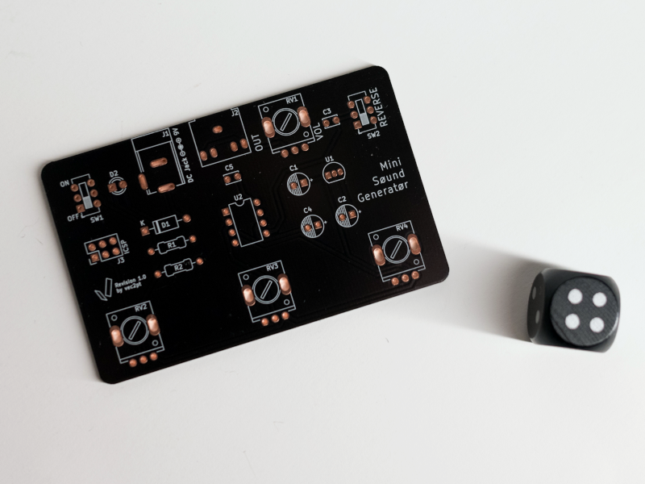

- Project stage: Beta Edition
- Tools: KiCad, Arduino
- Photos by: [Iza Rzechuła](https://www.iza.rzechula.pl/)
- Links:
    - [MSG](https://github.com/moffenzeefmodular/MSG)

PCB for MSG (Mini Søund Generatør) originally designed by Ross Fish Møffenzeef Mødular. The ino file can be found in the repository: [MSG](https://github.com/moffenzeefmodular/MSG)

\* **NOTE**: This project was created for personal use only and is not commercial.

### Schematic

### Photos

### BoM

|#  |Reference      |Qty|Value                   |Footprint                                                              |
|---|---------------|:-:|------------------------|-----------------------------------------------------------------------|
|1  |C1             |1  |10u                     |CP_Radial_D5.0mm_P2.50mm                         |
|2  |C2             |1  |100u                    |CP_Radial_D5.0mm_P2.50mm                         |
|3  |C3             |1  |470n                    |C_Disc_D3.4mm_W2.1mm_P2.50mm                             |
|4  |C4             |1  |1u                      |CP_Radial_D5.0mm_P2.50mm                         |
|5  |C5             |1  |100n                    |C_Disc_D3.4mm_W2.1mm_P2.50mm                             |
|6  |D1             |1  |1N4007                  |D_A-405_P10.16mm                                  |
|7  |D2             |1  |LED                     |LED_D3.0mm                                                     |
|8  |J1             |1  |Barrel_Jack_Switch      |BarrelJack_54-00166                              |
|9  |J2             |1  |AudioJack2_Ground_Switch|AudioJack_3.5                                    |
|10 |J3             |1  |Conn_01x06_Pin          |PinHeader_2x03_P2.54mm             |
|11 |R1,R2          |2  |1K                      |R_Axial_DIN0207_L6.3mm_D2.5mm_P10.16mm|
|12 |RV1,RV2,RV3,RV4|4  |100K                    |Potentiometer_R9011                              |
|13 |SW1,SW2        |2  |SW_Push_DPDT            |SW_Push_4x9                                      |
|14 |U1             |1  |L78L05_TO92             |TO-92_Inline                                        |
|15 |U2             |1  |ATtiny85-20P            |DIP-8_W7.62mm                                              |

### Files
- [20250112-msg-schematic.pdf](../assets/files/20250112-msg-schematic.pdf)
- [20250117-msg-gerber.zip](../assets/files/20250117-msg-gerber.zip)
