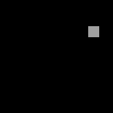
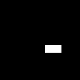

- Tools: Python
- Source code: [https://github.com/vec2pt/py-sketches](https://github.com/vec2pt/py-sketches)
- Links:
    - [Randomized depth-first search](https://en.wikipedia.org/wiki/Maze_generation_algorithm#Randomized_depth-first_search)
    - [Iterative randomized Kruskal's algorithm](https://en.wikipedia.org/wiki/Maze_generation_algorithm#Iterative_randomized_Kruskal's_algorithm_(with_sets))
    - [New Maze Generating Algorithm (Origin Shift)](https://www.youtube.com/watch?v=zbXKcDVV4G0)

### Depth-first search (DFS)



```python
from dataclasses import dataclass
from enum import IntEnum
from itertools import product
from random import randint

from PIL import Image, ImageDraw


class Direction(IntEnum):
    NONE = 0
    NORTH = 1
    EAST = 2
    SOUTH = 4
    WEST = 8

    def __repr__(self) -> str:
        return str(self.value)


@dataclass
class Cell:
    coords: tuple[int, int]
    direction: Direction = Direction.NONE
    visited: bool = False


class Maze:
    def __init__(self, width: int, height: int) -> None:
        """Maze (Depth-first search)

        Args:
            width (int): Maze width.
            height (int): Maze height.
        """
        self._width = width
        self._height = height
        self._cells = {
            coords: Cell(coords)
            for coords in product(range(self._width), range(self._height))
        }
        self._current_cell = self._cells[(0, 0)]
        self._current_cell.visited = True
        self._stack = [self._current_cell]

    def _get_neighbor(self, cell: Cell) -> Cell | None:
        neighbors = []
        directions = []

        x, y = cell.coords
        for coords, direction in zip(
            [(x, y - 1), (x + 1, y), (x, y + 1), (x - 1, y)],
            [Direction.NORTH, Direction.EAST, Direction.SOUTH, Direction.WEST],
        ):
            neighbor = self._cells.get(coords, None)
            if neighbor and not neighbor.visited:
                neighbors.append(neighbor)
                directions.append(direction)
        if neighbors:
            neighbor_index = randint(0, len(neighbors) - 1)
            neighbor = neighbors[neighbor_index]
            cell.direction += directions[neighbor_index]
            return neighbor

    def generate(self) -> None:
        """Generates a maze."""
        while len(self._stack) != 0:
            self._current_cell = self._stack[-1]
            self._stack.pop(-1)
            neighbor = self._get_neighbor(self._current_cell)
            if neighbor:
                self._stack.append(self._current_cell)
                neighbor.visited = True
                self._stack.append(neighbor)

    def plot(
        self, path_width: int = 32, wall_thickness: int = 8
    ) -> Image.Image:
        """Creates an image of a maze.

        Args:
            path_width (int, optional): Path width. Defaults to 32.
            wall_thickness (int, optional): Wall thickness. Defaults to 8.

        Returns:
            Image.Image: Maze image.
        """
        im = Image.new(
            "1",
            (
                self._width * (path_width + wall_thickness) + wall_thickness,
                self._height * (path_width + wall_thickness) + wall_thickness,
            ),
        )
        draw = ImageDraw.Draw(im)

        for cell in self._cells.values():
            if not cell.visited:
                continue
            im_x = (
                cell.coords[0] * (path_width + wall_thickness) + wall_thickness
            )
            im_y = (
                cell.coords[1] * (path_width + wall_thickness) + wall_thickness
            )
            draw.rectangle(
                (
                    (im_x, im_y),
                    (im_x + path_width - 1, im_y + path_width - 1),
                ),
                fill=1,
            )
            if cell.direction & Direction.NORTH:
                draw.rectangle(
                    (
                        (im_x, im_y - wall_thickness),
                        (im_x + path_width - 1, im_y - 1),
                    ),
                    fill=1,
                )
            if cell.direction & Direction.EAST:
                draw.rectangle(
                    (
                        (im_x + path_width, im_y),
                        (
                            im_x + path_width + wall_thickness - 1,
                            im_y + path_width - 1,
                        ),
                    ),
                    fill=1,
                )
            if cell.direction & Direction.SOUTH:
                draw.rectangle(
                    (
                        (im_x, im_y + path_width),
                        (
                            im_x + path_width - 1,
                            im_y + path_width + wall_thickness - 1,
                        ),
                    ),
                    fill=1,
                )
            if cell.direction & Direction.WEST:
                draw.rectangle(
                    (
                        (im_x - wall_thickness, im_y),
                        (im_x - 1, im_y + path_width - 1),
                    ),
                    fill=1,
                )
        return im


if __name__ == "__main__":
    maze = Maze(width=9, height=9)
    maze.generate()
    maze.plot().save("maze_dfs.png")
```

### Kruskal's algorithm



```python
from dataclasses import dataclass
from itertools import product
from random import shuffle

from PIL import Image, ImageDraw


@dataclass
class Cell:
    coords: tuple[int, int]
    group: int


@dataclass
class Wall:
    from_cell: tuple[int, int]
    to_cell: tuple[int, int]
    opening: bool = False


class Maze:
    def __init__(self, width: int, height: int) -> None:
        """Maze (Kruskal's algorithm)

        Args:
            width (int): Maze width.
            height (int): Maze height.
        """
        self._width = width
        self._height = height
        self._cells = {
            coords: Cell(coords, i)
            for i, coords in enumerate(
                product(range(self._width), range(self._height))
            )
        }
        self._walls = [
            Wall((i, k), (j, k))
            for i, j in zip(range(self._width - 1), range(1, self._width))
            for k in range(self._height)
        ] + [
            Wall((k, i), (k, j))
            for i, j in zip(range(self._height - 1), range(1, self._height))
            for k in range(self._width)
        ]
        shuffle(self._walls)

    def generate(self) -> None:
        """Generates a maze."""
        for wall in self._walls:
            from_cell = self._cells[wall.from_cell]
            to_cell = self._cells[wall.to_cell]
            if from_cell.group != to_cell.group:
                wall.opening = True
                group_min = min(to_cell.group, from_cell.group)
                group_max = max(to_cell.group, from_cell.group)
                for cell in self._cells.values():
                    if cell.group == group_max:
                        cell.group = group_min

    def plot(
        self, path_width: int = 32, wall_thickness: int = 8
    ) -> Image.Image:
        """Creates an image of a maze.

        Args:
            path_width (int, optional): Path width. Defaults to 32.
            wall_thickness (int, optional): Wall thickness. Defaults to 8.

        Returns:
            Image.Image: Maze image.
        """
        im = Image.new(
            "1",
            (
                self._width * (path_width + wall_thickness) + wall_thickness,
                self._height * (path_width + wall_thickness) + wall_thickness,
            ),
        )
        draw = ImageDraw.Draw(im)
        for cell in self._cells.values():
            im_x = (
                cell.coords[0] * (path_width + wall_thickness) + wall_thickness
            )
            im_y = (
                cell.coords[1] * (path_width + wall_thickness) + wall_thickness
            )
            draw.rectangle(
                (
                    (im_x, im_y),
                    (im_x + path_width - 1, im_y + path_width - 1),
                ),
                fill=1,
            )

        for wall in self._walls:
            if not wall.opening:
                continue

            if wall.from_cell[0] == wall.to_cell[0]:
                im_x = (
                    wall.from_cell[0] * (path_width + wall_thickness)
                    + wall_thickness
                )
                im_y = (wall.from_cell[1] + 1) * (path_width + wall_thickness)
                draw.rectangle(
                    (
                        (im_x, im_y),
                        (im_x + path_width - 1, im_y + wall_thickness - 1),
                    ),
                    fill=1,
                )
            elif wall.from_cell[1] == wall.to_cell[1]:
                im_x = (wall.from_cell[0] + 1) * (path_width + wall_thickness)
                im_y = (
                    wall.from_cell[1] * (path_width + wall_thickness)
                    + wall_thickness
                )
                draw.rectangle(
                    (
                        (im_x, im_y),
                        (im_x + wall_thickness - 1, im_y + path_width - 1),
                    ),
                    fill=1,
                )
        return im


if __name__ == "__main__":
    maze = Maze(width=9, height=9)
    maze.generate()
    maze.plot().save("maze_kruskals.png")
```

### Origin Shift


```python
from enum import IntEnum
from random import choice

from PIL import Image, ImageDraw


class Direction(IntEnum):
    NONE = 0
    NORTH = 1
    EAST = 2
    SOUTH = 4
    WEST = 8

    def __repr__(self) -> str:
        return str(self.value)


class Maze:
    def __init__(self, width: int, height: int) -> None:
        """Maze (Origin Shift)

        Args:
            width (int): Maze width.
            height (int): Maze height.
        """
        self._width = width
        self._height = height
        self._origin_node = (self._height - 1, self._width - 1)

        self._maze = [
            [Direction.EAST for _ in range(self._width - 1)] + [Direction.SOUTH]
            for _ in range(self._height)
        ]

        self._maze[self._origin_node[0]][self._origin_node[1]] = Direction.NONE

    def generate(self, iterations: int | None = None) -> None:
        """Generates a maze.

        Args:
            iterations (int | None, optional): Iterations. Defaults to None.
        """
        if iterations is None:
            iterations = self._width * self._height * 10

        for _ in range(iterations):
            options = [d for d in Direction if d != 0]
            if self._origin_node[0] == 0:
                options.remove(Direction.NORTH)
            elif self._origin_node[0] == self._height - 1:
                options.remove(Direction.SOUTH)
            if self._origin_node[1] == 0:
                options.remove(Direction.WEST)
            elif self._origin_node[1] == self._width - 1:
                options.remove(Direction.EAST)

            node_val = choice(options)
            self._maze[self._origin_node[0]][self._origin_node[1]] = node_val

            if node_val == Direction.NORTH:
                self._origin_node = (
                    self._origin_node[0] - 1,
                    self._origin_node[1],
                )
            elif node_val == Direction.EAST:
                self._origin_node = (
                    self._origin_node[0],
                    self._origin_node[1] + 1,
                )
            elif node_val == Direction.SOUTH:
                self._origin_node = (
                    self._origin_node[0] + 1,
                    self._origin_node[1],
                )
            elif node_val == Direction.WEST:
                self._origin_node = (
                    self._origin_node[0],
                    self._origin_node[1] - 1,
                )
            self._maze[self._origin_node[0]][self._origin_node[1]] = (
                Direction.NONE
            )

    def plot(
        self, path_width: int = 32, wall_thickness: int = 8
    ) -> Image.Image:
        """Creates an image of a maze.

        Args:
            path_width (int, optional): Path width. Defaults to 32.
            wall_thickness (int, optional): Wall thickness. Defaults to 8.

        Returns:
            Image.Image: Maze image.
        """

        im = Image.new(
            "1",
            (
                self._width * (path_width + wall_thickness) + wall_thickness,
                self._height * (path_width + wall_thickness) + wall_thickness,
            ),
        )
        draw = ImageDraw.Draw(im)

        for x, y in [
            (i, j) for i in range(self._width) for j in range(self._height)
        ]:
            im_x = x * (path_width + wall_thickness) + wall_thickness
            im_y = y * (path_width + wall_thickness) + wall_thickness
            cell_vec = self._maze[y][x]
            if cell_vec == Direction.NONE:
                draw.rectangle(
                    (
                        (im_x, im_y),
                        (im_x + path_width - 1, im_y + path_width - 1),
                    ),
                    fill=1,
                )
            elif cell_vec == Direction.NORTH:
                draw.rectangle(
                    (
                        (im_x, im_y - wall_thickness),
                        (im_x + path_width - 1, im_y + path_width - 1),
                    ),
                    fill=1,
                )
            elif cell_vec == Direction.EAST:
                draw.rectangle(
                    (
                        (im_x, im_y),
                        (
                            im_x + path_width + wall_thickness - 1,
                            im_y + path_width - 1,
                        ),
                    ),
                    fill=1,
                )
            elif cell_vec == Direction.SOUTH:
                draw.rectangle(
                    (
                        (im_x, im_y),
                        (
                            im_x + path_width - 1,
                            im_y + path_width + wall_thickness - 1,
                        ),
                    ),
                    fill=1,
                )
            elif cell_vec == Direction.WEST:
                draw.rectangle(
                    (
                        (im_x - wall_thickness, im_y),
                        (im_x + path_width - 1, im_y + path_width - 1),
                    ),
                    fill=1,
                )
        return im


if __name__ == "__main__":
    maze = Maze(9, 9)
    maze.generate()
    maze.plot().save("maze_origin_shift.png")
```
