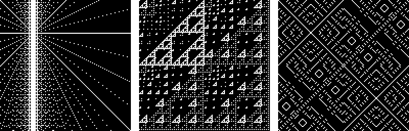

- Tools: Python
- Source code: [https://github.com/vec2pt/py-sketches](https://github.com/vec2pt/py-sketches)
- Inspirations:
    - [Algorithmic Art with the BitFieldDraw Module](https://inventwithpython.com/blog/2021/08/02/algorithmic-art-with-the-bitfielddraw-module/)
    - [Martin Kleppe - X posts](https://threadreaderapp.com/thread/1378106731386040322?refresh=1627428184)



```python
from typing import Callable

import numpy as np

from PIL import Image


def bit_field(
    size: tuple[int, int],
    func: Callable[[np.ndarray, np.ndarray], np.ndarray],
    scale: int = 1,
) -> Image.Image:
    """Bit Field.

    Args:
        size (tuple[int, int]): Image size. A 2-tuple, containing (width, height).
        func (Callable): Bit field function.
        scale (int, optional): Pixel scale. Defaults to 1.

    Returns:
        Image.Image: Invader image.

    """
    x, y = np.mgrid[0 : size[1] // scale, 0 : size[0] // scale]
    mask = func(x, y) == 0  # False is black
    mask_scaled = np.kron(mask, np.ones((scale, scale)))
    return Image.fromarray(mask_scaled.astype(np.uint8) * 255, "L")


def bit_field_rgb(
    size: tuple[int, int],
    func_r: Callable[[np.ndarray, np.ndarray], np.ndarray],
    func_g: Callable[[np.ndarray, np.ndarray], np.ndarray],
    func_b: Callable[[np.ndarray, np.ndarray], np.ndarray],
    scale: int = 1,
) -> Image.Image:
    """Bit Field (RGB).

    Args:
        size (tuple[int, int]): Image size. A 2-tuple, containing (width, height).
        func_r (Callable): Bit field function for R channel.
        func_g (Callable): Bit field function for G channel.
        func_b (Callable): Bit field function for B channel.
        scale (int, optional): Pixel scale. Defaults to 1.

    Returns:
        Image.Image: Invader image.

    """
    x, y = np.mgrid[0 : size[1] // scale, 0 : size[0] // scale]
    mask_r = func_r(x, y) == 0
    mask_g = func_g(x, y) == 0
    mask_b = func_b(x, y) == 0
    pattern = np.dstack([mask_r, mask_g, mask_b]).astype(np.uint8)
    pattern_scaled = np.kron(pattern, np.ones((scale, scale, 1)))
    return Image.fromarray(pattern_scaled.astype(np.uint8) * 255, "RGB")


if __name__ == "__main__":
    example_func1 = lambda x, y: (x ^ y) % 9
    bit_field_img = bit_field(size=(256, 256), func=example_func1)
    bit_field_img.save("bit_field1.png")

    example_func2 = lambda x, y: (x | y) % 7
    bit_field_img = bit_field(size=(256, 256), func=example_func2)
    bit_field_img.save("bit_field2.png")

    example_func3 = lambda x, y: (x & y) & (x ^ y) % 19
    bit_field_img = bit_field(size=(256, 256), func=example_func3)
    bit_field_img.save("bit_field3.png")

    example_func_r = lambda x, y: (x | y) % 7
    example_func_g = lambda x, y: (x | y) % 17
    example_func_b = lambda x, y: (x | y) % 29
    bit_field_rgb_img = bit_field_rgb(
        size=(256, 256),
        func_r=example_func_r,
        func_g=example_func_g,
        func_b=example_func_b,
    )
    bit_field_rgb_img.save("bit_field_rgb.png")
```


