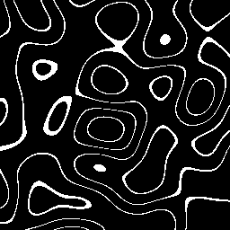

- Tools: Python
- Source code: [https://github.com/vec2pt/py-sketches](https://github.com/vec2pt/py-sketches)
- Links:
    - [OpenSimplex noise](https://en.wikipedia.org/wiki/OpenSimplex_noise)
    - [`opensimplex` for Python](https://pypi.org/project/opensimplex/)


```python
import numpy as np
import opensimplex
from PIL import Image


def min_max_scaling(array: np.ndarray) -> np.ndarray:
    """Min-Max scaling

    Args:
        array (np.ndarray): Array

    Returns:
        np.ndarray: Min-Max Scaled array
    """
    min_val = np.min(array)
    max_val = np.max(array)
    return (array - min_val) / (max_val - min_val)


def opensimplex_topography(
    isolines: list[float],
    width: int = 512,
    height: int = 512,
    noise_scale: float = 5.0,
    tolerance: float = 0.01,
) -> Image.Image:
    """OpenSimplex Topography

    Args:
        isolines (list[float]): List of isoline levels.
        width (int, optional): Width. Defaults to 512.
        height (int, optional): Height. Defaults to 512.
        noise_scale (float, optional): Noise scale. Defaults to 5.0.
        tolerance (float, optional): Tolerance. Defaults to 0.01.

    Returns:
        Image.Image: OpenSimplex Topography image.
    """
    shape = (height, width)
    x, y = (
        np.linspace(0.0, 1.0, shape[1]) * noise_scale * shape[1] / min(shape),
        np.linspace(0.0, 1.0, shape[0]) * noise_scale * shape[0] / min(shape),
    )

    noise = opensimplex.noise2array(x, y)
    noise = min_max_scaling(noise)

    topography_array = np.zeros_like(noise, dtype=bool)
    for iline in isolines:
        mask = np.logical_and(
            noise > iline - tolerance, noise < iline + tolerance
        )
        topography_array = topography_array | mask
    return Image.fromarray((255 * topography_array).astype(np.uint8), "L")


if __name__ == "__main__":
    opensimplex.seed(42)

    img = opensimplex_topography(isolines=[0.2, 0.4, 0.6, 0.8])
    img.save("opensimplex_topography.png")
```


