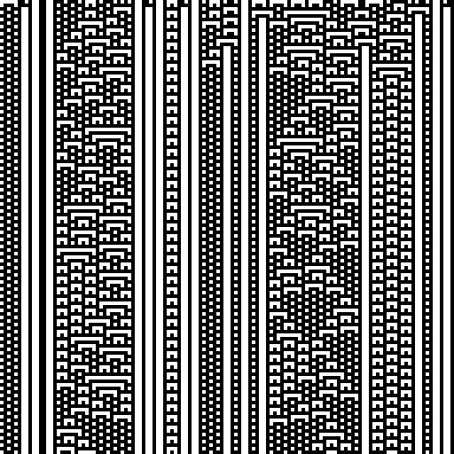
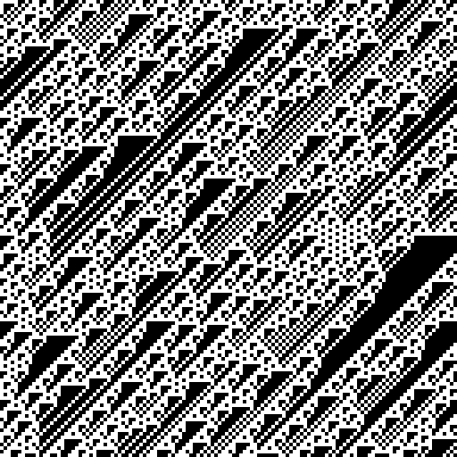
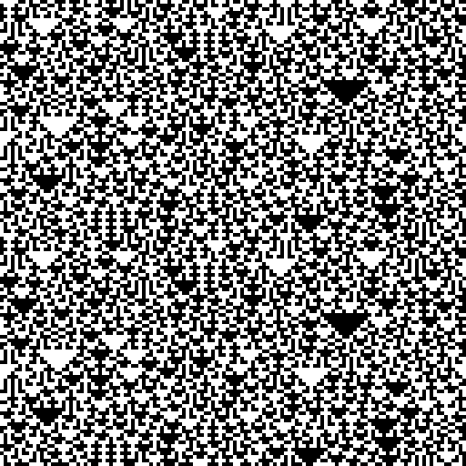

- Tools: Python
- Source code: [https://github.com/vec2pt/py-sketches](https://github.com/vec2pt/py-sketches)
- Links:
    - [Elementary cellular automaton](https://en.wikipedia.org/wiki/Elementary_cellular_automaton)

```python
import numpy as np
from PIL import Image, ImageOps


def eca(initial: np.ndarray, steps: int = 128, rule: int = 105) -> np.ndarray:
    """Elementary cellular automaton.

    Args:
        initial: Initial state.
        steps: Steps.
        rule: Rule.

    Returns:
        Elementary cellular automaton grid.

    """
    grid = np.zeros((steps, len(initial)), dtype=np.uint8)
    grid[0] = initial
    for t in range(1, steps):
        prev = grid[t - 1]
        pattern = (np.roll(prev, 1) << 2) | (prev << 1) | np.roll(prev, -1)
        grid[t] = np.vectorize(lambda x: (rule >> x) & 1)(pattern)
    return grid


if __name__ == "__main__":
    size = 128
    rule = 105
    initial_array = np.random.randint(0, 2, size=size, dtype=np.uint8)
    grid = eca(initial=initial_array, steps=size, rule=rule)
    img = Image.fromarray(grid * 255)
    ImageOps.scale(img, 4, Image.Resampling.NEAREST).save("eca.png")
```

### Rule 73



### Rule 106



### Rule 150


