- Tools: Python
- Source code: [https://github.com/vec2pt/py-sketches](https://github.com/vec2pt/py-sketches)
- Links:
    - [Elementary cellular automaton](https://en.wikipedia.org/wiki/Elementary_cellular_automaton)
    - [Reversible cellular automaton](https://en.wikipedia.org/wiki/Reversible_cellular_automaton)
    - [Second-order cellular automaton](https://en.wikipedia.org/wiki/Second-order_cellular_automaton)
    - [Wolfram MathWorld - Totalistic Cellular Automaton](https://mathworld.wolfram.com/TotalisticCellularAutomaton.html)

### Elementary cellular automaton

```python
import numpy as np
from PIL import Image, ImageOps


def eca(initial: np.ndarray, steps: int = 128, rule: int = 105) -> np.ndarray:
    """Elementary cellular automaton.

    Args:
        initial: Initial state.
        steps: Steps.
        rule: Rule.

    Returns:
        Elementary cellular automaton grid.

    """
    grid = np.zeros((steps, len(initial)), dtype=np.uint8)
    grid[0] = initial
    for t in range(1, steps):
        prev = grid[t - 1]
        pattern = (np.roll(prev, 1) << 2) | (prev << 1) | np.roll(prev, -1)
        grid[t] = np.vectorize(lambda x: (rule >> x) & 1)(pattern)
    return grid


if __name__ == "__main__":
    size = 128
    rule = 105
    initial = np.random.randint(0, 2, size=size, dtype=np.uint8)
    grid = eca(initial=initial, steps=size, rule=rule)
    img = Image.fromarray((1 - grid) * 255)
    img = ImageOps.scale(img, 4, Image.Resampling.NEAREST)
    img.save(f"eca-rule{rule}.png")
```

#### Rule 73

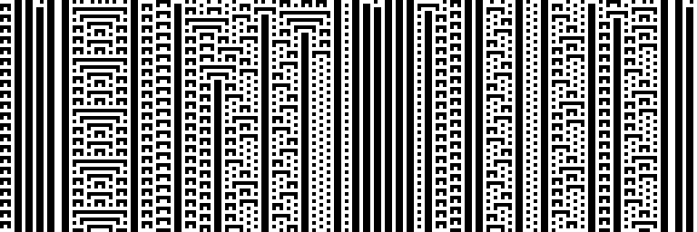

#### Rule 106

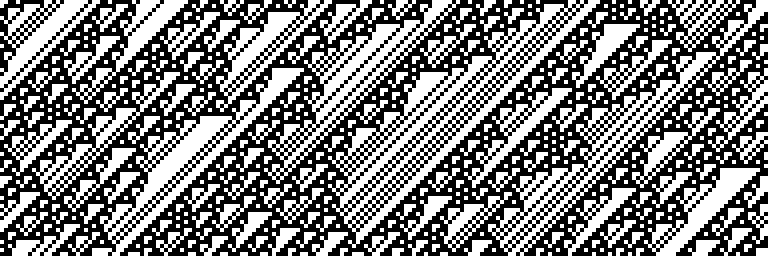

#### Rule 150

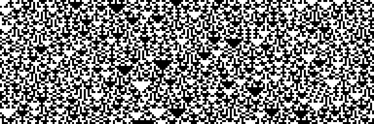


### Reversible cellular automaton / Second-order cellular automaton


```python
import numpy as np
from PIL import Image, ImageOps


def rca(initial: np.ndarray, steps: int = 128, rule: int = 105) -> np.ndarray:
    """Reversible cellular automaton.

    Args:
        initial: Initial state.
        steps: Steps.
        rule: Rule.

    Returns:
        Reversible cellular automaton grid.

    """
    grid = np.zeros((steps + 1, len(initial)), dtype=np.uint8)
    grid[0] = np.random.randint(0, 2, len(initial), dtype=np.uint8)
    grid[1] = initial
    for t in range(2, steps + 1):
        prev = grid[t - 1]
        pattern = (np.roll(prev, 1) << 2) | (prev << 1) | np.roll(prev, -1)
        grid[t] = np.bitwise_xor(((rule >> (7 - pattern)) & 1), grid[t - 2])
    return np.delete(grid, 0, 0)


if __name__ == "__main__":
    size = 128
    rule = 90
    initial = np.random.randint(0, 2, size=size, dtype=np.uint8)
    grid = rca(initial=initial, steps=size, rule=rule)
    img = Image.fromarray((1 - grid) * 255)
    img = ImageOps.scale(img, 4, Image.Resampling.NEAREST)
    img.save(f"rca-rule{rule}.png")
```

#### Rule 18

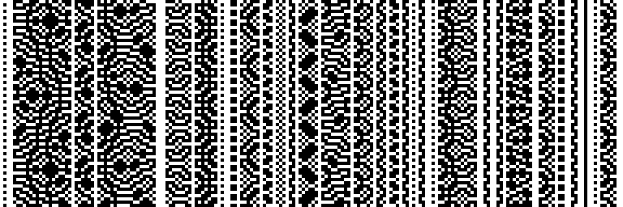

#### Rule 90

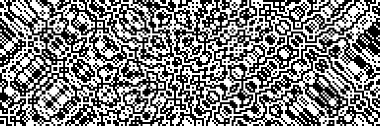

#### Rule 130

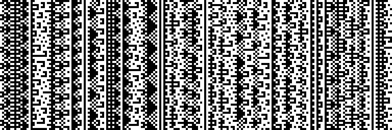


### Totalistic cellular automaton

```python
from typing import Callable

import numpy as np
from PIL import Image, ImageOps


def decode_code(code: int, k: int = 2, radius: int = 1) -> list:
    """Decode 'code'.

    Args:
        code: 'Code'
        k: Number of colors.
        radius: Radius.

    Returns:
        List of digits.
    """
    num_entries = (2 * radius + 1) * (k - 1) + 1
    digits = []
    for _ in range(num_entries):
        digits.append(code % k)
        code //= k
    return digits


def tca(initial: np.ndarray, steps: int, radius: int, rule: Callable):
    """Totalistic cellular automaton.

    Args:
        initial: Initial state.
        steps: Steps.
        radius: Radius.
        rule: Rule func.

    Returns:
        Totalistic cellular automaton grid.
    """
    grid = np.zeros((steps, len(initial)), dtype=np.uint8)
    grid[0] = initial

    for t in range(1, steps):
        _grid = np.tile(grid[t - 1], (radius * 2 + 1, 1))
        _shifts = np.arange(-radius, radius + 1)
        vals = np.vstack([np.roll(r, s) for r, s in zip(_grid, _shifts)]).sum(
            axis=0
        )
        grid[t] = np.vectorize(rule)(vals)
    return grid


if __name__ == "__main__":
    size = 128

    # Classic example
    rule = 0b001100  # 2, 3
    initial = np.random.randint(0, 2, size=size, dtype=np.uint8)
    grid = tca(
        initial=initial, steps=size, radius=2, rule=lambda x: (rule >> x) & 1
    )
    img = Image.fromarray((1 - grid) * 255)
    img = ImageOps.scale(img, 4, Image.Resampling.NEAREST)
    img.save(f"tca-0b{rule:b}.png")

    # Example with 'code'
    code = 777
    k = 3
    radius = 1
    initial = np.random.randint(0, k, size=size, dtype=np.uint8)
    grid = tca(
        initial=initial,
        steps=size,
        radius=radius,
        rule=lambda x: decode_code(code, k, radius)[x],
    )
    img = Image.fromarray(((k - 1) - grid) * int(255 / (k - 1)))
    img = ImageOps.scale(img, 4, Image.Resampling.NEAREST)
    img.save(f"tca-code{code}.png")
```

#### `001100`

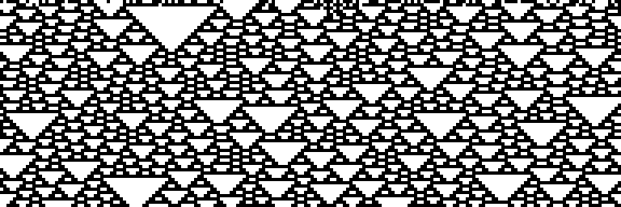

#### `110100`

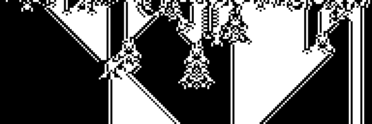

#### `110101`

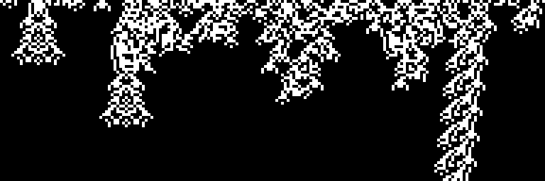

#### Code 777

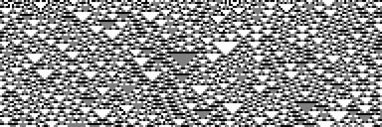

#### Code 1803

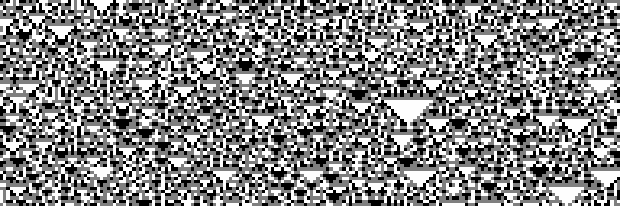

#### Code 2040

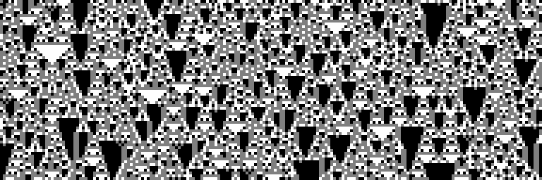
