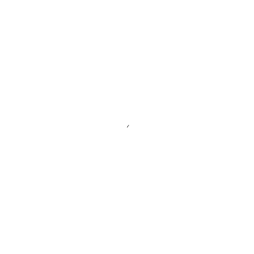
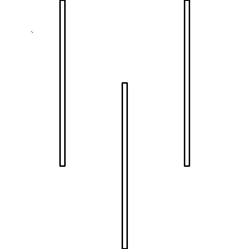

- Tools: Python
- Source code: [https://github.com/vec2pt/py-sketches](https://github.com/vec2pt/py-sketches)
- Links:
    - [Rapidly exploring random tree](https://en.wikipedia.org/wiki/Rapidly_exploring_random_tree)




```python
import math
import random
from dataclasses import dataclass
from typing import Self

from PIL import Image, ImageDraw


@dataclass
class Node:
    """Node.

    Attributes:
        x: Node x.
        y: Node y.
        parent: Node parent.
    """

    x: float
    y: float
    parent: None | Self = None

    def __eq__(self, other):
        return self.x == other.x and self.y == other.y


@dataclass
class Wall:
    """Simple wall.

    Attributes:
        x1: Start point x.
        y1: Start point y.
        x2: End point x.
        y2: End point y.
    """

    x1: float
    y1: float
    x2: float
    y2: float


def distance(node1: Node, node2: Node) -> float:
    """Distance between two nodes.

    Args:
        node1: First node.
        node2: Second node.

    Returns:
        Distance.
    """
    return math.hypot(node1.x - node2.x, node1.y - node2.y)


def is_intersect(p00, p01, p10, p11) -> bool:
    """Checks whether two line segments intersect.

    Args:
        p00: Start point of first segment.
        p01: End point of first segment.
        p10: Start point of second segment.
        p11: End point of second segment.

    Returns:
        True if intersect / False if not.
    """

    def orientation(a, b, c):
        return (b[0] - a[0]) * (c[1] - a[1]) - (b[1] - a[1]) * (c[0] - a[0])

    def on_segment(spt1, spt2, pt):
        x_test = min(spt1[0], spt2[0]) <= pt[0] <= max(spt1[0], spt2[0])
        y_test = min(spt1[1], spt2[1]) <= pt[1] <= max(spt1[1], spt2[1])
        return x_test and y_test

    s1 = orientation(p00, p01, p10)
    s2 = orientation(p00, p01, p11)
    s3 = orientation(p10, p11, p00)
    s4 = orientation(p10, p11, p01)

    return any(
        [
            # General
            ((s1 > 0) != (s2 > 0) and (s3 > 0) != (s4 > 0)),
            # Collinearity
            (s1 == 0 and on_segment(p00, p01, p10)),
            (s2 == 0 and on_segment(p00, p01, p11)),
            (s3 == 0 and on_segment(p10, p11, p00)),
            (s4 == 0 and on_segment(p10, p11, p01)),
        ]
    )


class RRT:
    """Rapidly exploring random tree (RRT)."""

    def __init__(
        self,
        initial_tree: list[Node],
        step_size: float = 5,
        walls: list[Wall] | None = None,
        allow_self_intersection: bool = True,
        size: tuple[int, int] = (512, 512),
    ) -> None:
        """Rapidly exploring random tree (RRT).

        Args:
            initial_tree: Initial tree.
            step_size: Step size.
            walls: List of walls.
            allow_self_intersection: Allow self intersection.
            size: Size.
        """
        self._tree = initial_tree
        self.step_size = step_size
        self._walls = walls
        self._allow_self_intersection = allow_self_intersection
        self._size = size

    @property
    def tree(self):
        """Rapidly exploring random tree."""
        return self._tree

    def _is_self_intersection(self, node: Node) -> bool:
        for n in self._tree:
            if n.parent is None or node.parent is None:
                continue
            if node.parent in (n, n.parent):
                continue
            a, b, c, d = (
                (node.parent.x, node.parent.y),
                (node.x, node.y),
                (n.parent.x, n.parent.y),
                (n.x, n.y),
            )
            intersect = is_intersect(a, b, c, d)
            if intersect:
                return True
        return False

    def _is_collision(self, node: Node) -> bool:
        if node.parent is None:
            raise Exception(
                "Collision checking is not possible for a node without a parent."
            )
        if self._walls:
            for wall in self._walls:
                a, b, c, d = (
                    (node.parent.x, node.parent.y),
                    (node.x, node.y),
                    (wall.x1, wall.y1),
                    (wall.x2, wall.y2),
                )
                intersect = is_intersect(a, b, c, d)
                if intersect:
                    return True
        return False

    def __iter__(self) -> Self:
        return self

    def __next__(self) -> Node | None:
        random_node = Node(
            random.uniform(0, self._size[0]), random.uniform(0, self._size[1])
        )
        nearest = min(self._tree, key=lambda n: distance(n, random_node))
        theta = math.atan2(random_node.y - nearest.y, random_node.x - nearest.x)
        new_node = Node(
            nearest.x + self.step_size * math.cos(theta),
            nearest.y + self.step_size * math.sin(theta),
            parent=nearest,
        )

        if self._is_collision(new_node):
            return
        if not self._allow_self_intersection and self._is_self_intersection(
            new_node
        ):
            return
        self._tree.append(new_node)
        return new_node

    def plot(self) -> Image.Image:
        im = Image.new("L", self._size, 255)
        draw = ImageDraw.Draw(im)
        for node in self._tree:
            if node.parent:
                draw.line(
                    (node.x, node.y, node.parent.x, node.parent.y), fill=0
                )
        if self._walls:
            for w in self._walls:
                draw.line((w.x1, w.y1, w.x2, w.y2), fill=0, width=3)
        return im


if __name__ == "__main__":
    width, height = 512, 512
    rrt = RRT(initial_tree=[Node(width / 2, height / 2)], size=(width, height))

    steps = 5000
    for i in range(steps):
        _ = next(rrt)

    rrt.plot().save("rrt.png")
```


